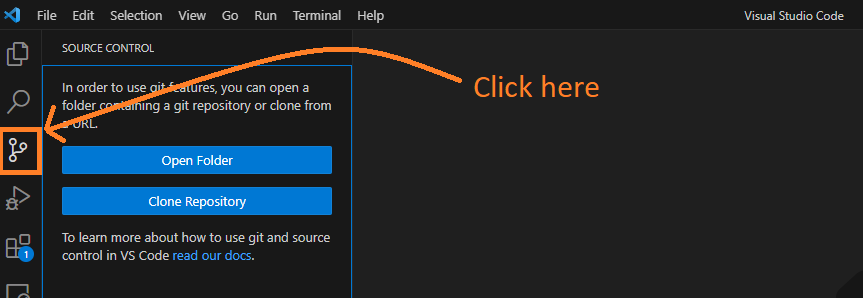
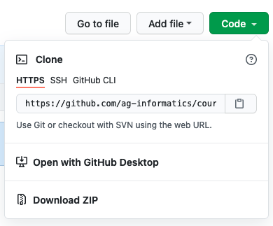

# Module 1, Lab 1

## Orientation
### Creating websites
**HTML** is a HyperText Markup Language used to outline and lay out web pages. **CSS**, or Cascading Style Sheets, is a language used to visually style content delivered via websites.

Together these languages structure and style web content. If you're interested in building web applications, these languages are the first step.

> In this lab, you will build your own portfolio as a simple static website using HTML and CSS.

### Writing and managing code
**Git** is a version control system that tracks changes to your code. With Git, you no longer need to keep multiple files around as backups — you can see a full history of your development. Each commit records a timestamp, a comment, and the changes made line by line, and you can revert to any previous commit at any time.

There are other version control systems, for example [Subversion (SVN)](https://subversion.apache.org/) or [Mercurial](https://www.mercurial-scm.org/). However, Git is the most popular choice, as it's easy to use and supported by many cloud source code hosting platforms.

**GitHub** is a cloud platform that hosts your source code using Git. It doesn't just host your code — it also has features for collaborating among developers, such as issues, discussions, and project boards. There are other platforms, e.g. [GitLab](https://about.gitlab.com/why-gitlab/) or [Bitbucket](https://bitbucket.org/product), but GitHub is a popular choice.

Tools like GitHub synchronize your code between your computers. You can work on your code during lab on a department computer, and as long as you push your code to GitHub, you can pick it back up on your personal computer too. If you work on team projects, your collaborators will also be able to see your changes. With features like issue tracking, discussions, and code security alerts, Git and GitHub have become common tools worth adding to your toolbox.

> Your GitHub repositories can serve as an online coding portfolio/resume for potential employers (a common practice in the tech sector). It's also a common software development tool, including in ag-tech research and industry. It's a good idea to know how to use Git!

## AI Use Policy for this Lab

Across these learning modules, we will move through three levels of AI-assisted programming (see [course readme](../../README.md) for details).

This lab involves:
> **No AI-generated code.** (Modules 1-3 default.) Do not use AI tools to generate code for this lab — hand-crafting code is the point. Discussion/ideation with AI is fine per the general Academic Integrity policy; writing your code is not.

## BEFORE THE LAB

### STEP 0: Identify and fill your knowledge gaps
As described in the [course readme](../../README.md), I will curate learning materials to supplement what we do in class. These will typically be more detailed programming fundamentals to help you fill in your knowledge gaps.

#### To learn the fundamentals of HTML & CSS:
> Watch this CS50 video: https://cs50.harvard.edu/web/weeks/0/.
> If you scroll past the video, you can select other learning modalities. For instance, I recommend checking out the "notes" version for self-paced learning: https://cs50.harvard.edu/web/notes/0/

For general HTML/CSS reference materials:
* Use this [W3Schools HTML Reference](https://www.w3schools.com/tags/default.asp). I use this like a dictionary.
* Supplement with [Mozilla Foundation's HTML References](https://developer.mozilla.org/en-US/docs/Web/HTML). These have good tutorials too!

#### To learn the fundamentals of Git version control
> Watch this CS50 video on Git: https://cs50.harvard.edu/web/weeks/1/

We will not be using Git as comprehensively as introduced in this video, but you will need to understand how to use the following commands at minimum:

- `git clone "url"` to clone a remote repository to your local machine
- `git pull` to pull changes from a remote repository
- `git init` to initialize a repository
- `git add .` to add all (".") changes here to your local version of the repository
- `git commit -m "message here"` to commit all your changes with a message
- `git push` to send all your local changes to the remote repository

Some additional materials:
*  [Basics on Git](https://git-scm.com/book/en/v2/Git-Basics-Recording-Changes-to-the-Repository)
* [Visualization of how git works](https://onlywei.github.io/explain-git-with-d3/#commit)
* [Full GitHub training module](https://skills.github.com/)

### STEP 1: SETUP your Software Development Environment
#### Install Visual Studio Code (VS Code) to write code
Visual Studio Code is an open-source, multi-platform code editor. This means you can use it at no cost, and it's available on multiple platforms, e.g. Windows, Mac, or Linux.

To install, check this website: https://code.visualstudio.com.

#### Create a GitHub account, and install Git on your computer
Create an account on GitHub: https://www.github.com.
If you already have a GitHub account, feel free to use it. We will use GitHub to share our code with each other. You'll receive labs via GitHub (like this one), and I will expect you to submit your GitHub repository link.

GitHub (the account you just created) is the cloud platform; **Git** is the actual version-control tool your computer needs installed to talk to it. Install Git using this tutorial: https://github.com/git-guides/install-git.

### STEP 2: Use Git to access course materials

This lab and other course materials are shared via a GitHub repository that the whole class reads from — separate from the personal repository you'll create in Step 3 to hold your own work.

You will need to `clone` it to have a copy of these materials on your computer. You have two options.

#### Using VS code and GitHub integration

1. Click on the "Source Control" tab on the left panel (or ctrl + shift + g),

2. Click "Clone Repository". You will see a box appear in the middle top of the screen.

3. Place this URL: `https://github.com/ag-informatics/ag-informatics-course`

4. VS Code will ask you for a location to keep the class material folder.

5. Open the folder

6. If you check the "Source Control" tab again, you will see either

   - A list of files that you've made changes to locally.
   - An option to sync changes with GitHub. You can download the course update by clicking this.

#### Using Git command line

1. Open the terminal

   - For Windows: Search for `command prompt` or windows key + r then type cmd.
   - For Mac: Search for `terminal`.
   - For Linux: Search for `terminal` or ctrl + alt + t.

2. Navigate to the folder that you want to keep the class material repository in. Use command `pwd` to check your current directory. Then use `cd "folder_name"` to enter the folder or `cd ..` to exit the folder.

- Tip: You can type the first few letters of a folder's name then press `tab` on your keyboard for autocompletion (the system will type the rest of the name automatically).

- Tip 2: For Windows, you can use Windows Explorer to navigate to the directory that you want, then type `cmd` on the directory bar (where it shows the directory hierarchy).

3. Clone this repository using `git clone https://github.com/ag-informatics/ag-informatics-course`. You can view the repository URL by clicking on the green "Code" button. This command will clone the code from GitHub to your local repository while still linking with the cloud, so you can use another git command to update the clone folder.

- Note: You can download source code as a ZIP file, but it will only be a snapshot of the code at the moment you download it. You will not be able to use any git commands in ZIP-downloaded repositories.

4. Every week, I will update this repository with new things. You can update your local repository by running `git pull` to pull the changes from the web. When you navigate to the folder containing the repository on your local machine, you will be able to see the changes.

## LAB INSTRUCTIONS

### STEP 3: Create Your First Repository

In this lab, you will create your profile page and host it on GitHub. So the first step is creating a new repository. You should see a green "New" button in your "Repositories" tab on GitHub, or you can click [here](https://github.com/new). For this lab, you must name your repository **"username.github.io"** and make this repository **<u>public</u>**. The **username** is your GitHub username.

>Academic Integrity Reminder: This is the only lab where your GitHub repository is public. For lab 2 and the rest of the class, the repository must be private.

In [Step 2](#step-2-use-git-to-access-course-materials), you cloned a repository using either VS Code or the Git command line. You can follow the same procedure to clone your newly created repository. Alternatively, you can use VS Code's integrated GitHub feature, which will allow VS Code to access all of your repositories for your convenience.

1. Open a new blank VS Code window
2. Click on the "Source Control" tab on the left panel (or ctrl + shift + g), then you will see an option to Clone Repository
3. Allow VS Code to access your GitHub profile by clicking on "Clone from GitHub"
4. You will need to go through the authentication process. At the end, you will see a list of all repositories in your GitHub account. Choose the one that you just created.

### STEP 4: Create and preview your website file structure
**File structure**

- Create a file called "index.html". You will be making a basic web page to showcase your work.
- Create a file called "styles.css". This will contain all the CSS for your webpage. Make sure you link it in the "head" section of your index.html web page.
- Create a folder called "img", this will contain any images that you use on the webpage.

**Web preview**
You can open your HTML file in your preferred web browser (such as Chrome). Another option is to use a VS Code extension to render the HTML webpage. You can install an extension by clicking on "Extensions" on the left panel (or ctrl + shift + x). Search for "Live Preview" by Microsoft. To open the preview, first open the VS Code command palette by pressing ctrl + shift + p, then type "Live Preview: Show Preview". Alternatively, you can right-click on the HTML file and choose the "show preview" option.

### STEP 5: Translate mockup to HTML + CSS

Sketch a static profile webpage that looks similar to the mockup below.

> Your proposed website can be different! This is just an example of a reasonable level of complexity for a beginner profile. You will **not** be graded on how closely you follow this list — it's here to illustrate one way of breaking a design down into buildable pieces, not a checklist to match exactly. We'll practice this kind of mockup-to-layout decomposition together in lecture 1.2.

**For example, one way to break this mockup down:**

1. A `
` with the ID "header" — for an introduction, e.g., "Hi! I'm Ankita".
   - Ideas: give it a minimum height (e.g., 40px), center the text, use a font style/size different from the rest of the page, or try CSS's "small caps" text transform.

2. A `
` with the ID "about" — a photo of yourself with a description of what you do.
   - Ideas: a border around the photo; a distinct font/size for the description.
   - Include a few hyperlinks (your GitHub repository, LinkedIn, etc.). A "mailto" link is one way to let a visitor's default mail client open, addressed to you — an icon from [the Noun Project](https://thenounproject.com/search/icons/?q=mail) could label it.

3. A `
` with the ID "work-samples" — a placeholder image and short description for a few pieces of work, e.g. laid out with a flexbox, table, or grid.
   - A list element (ordered or unordered) is one reasonable way to hold each entry's description text — CSS can remove the bullet symbols if you don't want them, and you can align the text vertically with its image.

4. A `
` with the ID "footer" — your name and the date this page was last updated.
   - A solid background color is one way to set it apart visually.

5. Somewhere in your HTML/CSS:
   - Center your content in the browser.
   - Set the "viewport" correctly so your webpage is "responsive" — i.e., it scales for different device sizes.

### STEP 6: Commit & Push your code to GitHub

It's good practice to commit after you make significant progress. It helps prevent bugs, and if one happens, you can revert to the previous working version at any time. I expect to see an appropriate number of distinct commits in your repository history per lab (4+ for lab 1), with meaningful comments, demonstrating that you worked on your project over a period of time rather than all at once.

VS Code has a feature to make commits and push. Check the "Source Control" tab on the left panel (or ctrl + shift + g). You should see a list of files that have changed (`git status`). Click "+" to add file(s) (`git add`), write a commit message, then click "commit" (`git commit`). You'll then see an option to sync your repository with GitHub (`git push`).

Alternatively, open a terminal and navigate to the repository directory (the same way you did when you cloned the repository). Or use VS Code's built-in terminal by clicking "Terminal" on the top panel, then "New Terminal" (or ctrl + shift + `) — this opens in the repository directory by default.

Run `git status` to see a list of files that have changed since the latest commit. Select the file(s) you want to track in this commit with `git add filename1 filename2 ...` (or `git add .` to add all files), then commit with `git commit -m "message here"`. At this point, the commit is recorded on your local machine. To update your cloud repository on GitHub, run `git push`. You can make multiple local commits before you push to GitHub.

**Note**: You might need to tell Git who is making the commit, via `git config user.name "your GitHub username"` and `git config user.email "your email"`.

### STEP 7: Deploy your website via GitHub Pages

GitHub allows you to host static webpages from your repositories. We are going to host your profile webpage this way. Follow the instructions below:

1. Click "Settings" tab on your repository
2. Look for a tab "Pages" on the left panel
3. Select "Deploy from a branch" option
4. Choose "main" branch and `/(root)` folder
5. You should see your website URL in a minute

Now you have your own personal webpage to share with the world!

**Note**: There are multiple options for deploying GitHub Pages. In this lab, we deploy from the "main" branch, and GitHub looks for a file named `index.html` in the root folder. You can choose to deploy from a different branch or folder instead.

## How to Submit your Lab - GitHub + Brightspace

First, make sure that you have 4+ commits in your GitHub repository. The instructors will look not only at your final result, but also your commit history (see Academic Integrity Reminder).

To make the submission, go to the assignment tab on Brightspace. You will need to put two links as your submission:

1. URL to your GitHub repository
2. URL to your profile page

### Academic Integrity Reminder

<!-- Submission Policy snippet — see documentation/SNIPPETS.md, edit there first -->

**You will learn how to demonstrate transparent coding practices throughout this course.** In your first lab, you will learn how to set up private and public software repositories on GitHub, which you'll use to host the code for your lab assignments. In this repository, you will save versions of your code over time, while also demonstrating how and why you're changing your code as you learn.

**Your private ASM532 assignment repositories will contain one folder per lab.** Make sure you keep this repo private for the duration of the course. This will also prevent others from copying your code, while still letting you share your code's history with us.

**For each lab, you should have 4+ "commits" to your repo.** For example, you'll push your code at the beginning and end of each lab — but since it's good practice to commit between major changes, I hope you'll end up with more than 4 commits! Don't commit your entire lab 5 minutes before the deadline — we'll check your commit history to assess your version control skills.

**Each commit should have a meaningful commit message that explains how/why you changed your code.** For example, if you'd just written the code to render a graph of your processed data, your commit message could read something like: "used matplotlib to plot corn commodity prices over time for 5 states. yay!"

## License

This work by [Ankita Raturi, Purdue University](https://github.com/ag-informatics/ag-informatics-course) is licensed under [CC BY-NC-SA 4.0](https://creativecommons.org/licenses/by-nc-sa/4.0/).
