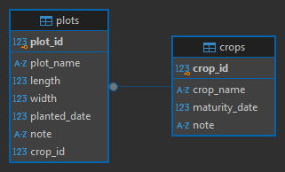

# Module 3, Lab 3: Data Model

## Orientation

You will work at three levels of abstraction, practicing the **concept modeling** workflow that can help technology designers scope and specify appropriate data models that reflect users' mental models and scaffold their context-specific activities. 

First you will create a **concept model**, conducting a "lite" task analysis to map data flows in a domain-specific system that you are familiar with. We will draw this out together in-class.

Second, you will translate concepts into an **object model**, thinking about the concrete objects, attributes, operations, and relationships that will need to be represented. You will translate this into formal visual notation in lab.

Third, you will implement the **data model** using real tables in a real database, while using Python classes to read and write data. This is the beginning of the programming section of this lab.
 
Future labs that involve developing an entire web application will build on this approach, so it's critical to become comfortable with the modeling workflow. 

> In this lab, you will map a system you care about, model domain concepts, articulate an object model, and implement a data model as queriable database.

### Defining concept, object, and data models

Each level renames the same three things as it gets formalized into code. The thing itself does not change; the vocabulary gets more precise.

| Level | Things | Details about the thing | Connections between things | Where is it? |
| --- | --- | --- | --- | --- |
| **1. Concept model** | concept | detail | labelled line | on paper |
| **2. Object model** | object | attribute | relationship | on paper, in a diagram |
| **3. Data model** | table (or *entity*) | column (or *field*) | foreign key | in a diagram, in the database |

**Why "entity" as well as "object"?** Because you will meet both terms in the wild! 
* Database writing says *entity*, and the standard name for a data model diagram is an **entity-relationship diagram (ERD)**. 
* Design writing says *object*, which is the term used when doing object-oriented Python programming. 

They are two sides of a coin: we will say **object** while designing (or coding in Python), and **table** once we are in the database.

### Visualizing the data model

There is no single notation for drawing a data model, i.e., the database schema. The same relationship — *a person is born in one location; a location is the birthplace of many people* — can be drawn in at least six different ways, including Chen, IDEF1X, Bachman, Martin (Crow's Foot), Min-Max/ISO and UML: [compare them side by side](https://en.wikipedia.org/wiki/Entity%E2%80%93relationship_model).

**You do not need to learn six notations.** You need to recognize that the family exists, so a diagram in a paper or a vendor's documentation is readable rather than alarming. We'll look at the differences in lecture.

For this lab, pick **one notation** and stay in it. Your diagramming tool offers each family as its own shape library:

1. **Plain DB table** — a box per table listing its attributes, with `PK` and `FK` marked. Simplest to read, and the closest match to what you build in STEP 7. **Recommended if this is new to you.**
2. **Crow's Foot** — a box per entity, with fork, ring and bar symbols on the relationship lines. The notation you are most likely to see in database documentation. [Learn more](https://www.creately.com/guides/crows-foot-notation/#what-is-crows-foot-notation)
3. **UML class diagram** — a divided box holding the name, the attributes, and optionally the operations. Multiplicity is written as numbers instead of symbols: `1..1`, `1..*`, `*..*`. Common when reading more comprehensive software documentation.

> Don't borrow symbols from a neighbouring family — your diagram should be readable by someone who knows that one notation.

Still having trouble picking one? [Check out this explainer](https://creately.com/guides/uml-vs-erd/)

### Working with relational databases

A **relational model** or **relational database** structures data as tables that are "related" to each other. "Relation" is the formal word for a table, and tables are linked by matching values rather than by nesting one inside another.

> Note how this differs from the concept level, where a relationship like *a CAT is a type of ANIMAL* or *LETTUCE is a part of a SALAD* is about meaning. In a database, a relationship is a matched value: this plot's `crop_id` equals that crop's `crop_id`. Getting from the first kind to the second is the translation you are practicing in this lab.

The **Structured Query Language (SQL)** is a declarative query language used to handle structured data using this relational model. "Declarative" means you state *what* you want rather than how to fetch it — `SELECT * FROM crops;` queries the database to "give me everything in crops".

* As a relational database, SQL `DATABASES` allow for data to be represented as linked `TABLES`.
* Each `RECORD` is a row, observation, or data entry. 
* Each column is a `FIELD` that represents an attribute of the entity. 
* The `PRIMARY KEY` serves as a unique identifier for each `RECORD`. 
* The `FOREIGN KEY` represents attributes that serve as a pointer, reference, or link between `TABLES`. 

**Cardinality** is how many of one thing relate to how many of another. The common case is **one-to-many**: one crop, many plots. The foreign key always lives on the *many* side — `crop_id` goes in the plots table, because each plot has exactly one crop.

Notation shows and enumerates it. For instance, in Crow's Foot notation: a **fork** means "many", a **bar** means "exactly one", and a **ring** means "zero is allowed". Ring-versus-bar is the diagram's way of saying what `not null` says in SQL.

A **lookup list** is an attribute whose value must come from a fixed set — a crop type, a soil class, a status. Rather than let people type free text that drifts in spelling, a lookup list becomes its own small table that other tables point at.

A **Database Management System (DBMS)** is software to store, organize, and retrieve data. 

In this course we use **SQLite**, a relational DBMS that is simply a file on disk — there is no server to install or manage, which is what the "lite" refers to. Postgres and MySQL are the free alternatives you are most likely to meet at work; [Oracle](https://www.oracle.com/database/) and [Microsoft Access](https://www.microsoft.com/en-us/microsoft-365/access) are paid.

**SQLAlchemy** is a Python library that lets you work with database rows as ordinary Python objects. A table becomes a class, a row becomes an instance, and a foreign key becomes an attribute you can follow — which is why the object model you draw in Part 1 survives all the way into code.

## AI Use Policy for this Lab

Across these learning modules, we will move through three levels of AI-assisted programming (see [course readme](../../README.md) for details).

This lab involves:

> **AI for debugging/exploration only.** (Modules 3-5 default.) Write your pseudocode and function outlines by hand first; use AI only to debug, explore alternatives, or ask thoughtful questions once you're stuck — not to generate the initial code.

**What does responsible AI use look like?** 

&#129488; **Part 1 - Conceptual Modeling** is pen-and-paper thinking about a system YOU know. Do NOT hand it to an AI, because the point is convey *your* understanding of *your* domain. 

&#128078; AI will give you a generic answer for a generic problem. 

&#129488; For **Part 3 - the Database Implementation**, write each model class and query yourself first. Debugging is detective work, but when errors are genuinely cryptic, get the help you need.

&#128591; When something breaks, try do a simple web search first and read the answers - does that tell you want you need to know? Then try use AI to interpret the error, explain what a constraint means, or suggest why a query returns nothing is exactly the intended use, and even then, ask for references or pointers to learning materials that you can verify.

&#128078; Asking AI to write your model classes for you is straight-up cheating. Don't cheat yourself from learning.

And yes, I agonized over which emojis best conveyed my feelings. You can also learn how to manually select and insert [HTML-emojis](https://www.w3schools.com/charsets/ref_emoji_intro.asp).

## BEFORE THE LAB

### STEP 0 - Identify and fill your knowledge gaps

#### Start thinking about your problem domain + sample data

You are choosing your own problem domain and data for this lab.  You don't need to have decided before the lab — we'll start the conceptual modeling process in class — but arriving with a topic you actually care about means you don't lose time thinking about what to work on.

Two options:

1. Consider a system you know well enough to describe from memory, that you have sample data for or can easily generate sample data for: your research, a job, your family farm or business, a student organization you are active in. **Do not bring proprietary or private data that you are not allowed to share with us.**
2. If you cannot identify a problem domain or have a sample dataset, let us know and we will help you figure it out!

#### Learn or refresh your SQL and database fundamentals

Read these three before lab if the concepts are new to you:

- [Entity Relationship Diagram (ERD) basics](https://www.geeksforgeeks.org/dbms/introduction-of-er-model/)
- [How to create a new table](https://www.sqlitetutorial.net/sqlite-create-table/)
- [How foreign keys work](https://learnsql.com/blog/why-use-foreign-key-in-sql/)

Learning materials referenced in the lectures:
* [Conceptual models](https://link.springer.com/book/10.1007/978-3-031-02195-4) - pairs with Lecture 3.2
* [Designing data-intensive applications, Ch 2. Data models and query languages](https://learning.oreilly.com/library/view/designing-data-intensive-applications/9781491903063/ch02.html) - pairs with Lectures 3.2 and 3.3
* [Model-driven architecture in practice](https://link.springer.com/book/10.1007/978-3-540-71868-0) - pairs with Lectures 3.2 and 3.3

Learn more about ERDs and SQL, but not required to finish this lab: 
* [a worked example of drawing an ERD](https://www.geeksforgeeks.org/sql/how-to-draw-entity-relationship-diagrams/)
* [mapping an ER model to a relational database](https://www.geeksforgeeks.org/dbms/mapping-from-er-model-to-relational-model/)
* [representing relationships: is a child of, is a part of](https://www.geeksforgeeks.org/dbms/generalization-specialization-and-aggregation-in-er-model/)
* [30 days of SQL](https://www.geeksforgeeks.org/sql/30-days-of-sql-from-basic-to-advanced-level/)

#### Install SQLite or check your SQLite installation:

- **macOS:** SQLite ships by default. Open a terminal and type `sqlite3`; you should see a
version number and a prompt. Type `.quit` to exit.
- **Windows:** download `sqlite-tools-win-x64-*.zip` from [sqlite.org/download](https://www.sqlite.org/download.html),
  extract it, and run `sqlite3.exe` from PowerShell.
- **Linux:** install via your package manager, e.g. `sudo apt install sqlite3`.

#### Install a UML diagram editing tool

Select one of the following diagramming tools (or let us know if you plan to use something else):

* [Miro](https://miro.com/diagramming/uml-diagram/): a digital whiteboard software, that includes a UML shape library **(free, recommended)**
* [Creately](https://creately.com/lp/uml-diagram-tool/): a general purpose diagramming software, that includes a UML shape library.

If you want more advanced tools down the line, check out: [Papyrus UML](https://eclipse.dev/papyrus/) - an industry-grade modeling environment that supports UML to code workflows, while also being free and open source! Paid alternatives include [Microsoft Visio](https://www.microsoft.com/en-us/microsoft-365/visio) and [Visual Paradigm](https://www.visual-paradigm.com/).

#### Create your Lab 3 folder

In your github repository for this course, create a `lab3` folder:

```
lab2            <-- previous lab submission
lab3            <-- new folder for this lab
README.md       <-- optional (you can describe your work here if used as a code portfolio)
```

---

## Part 1 - CONCEPTUAL MODELING -- in class activity, finish on your own.

We'll begin this pen-and-paper portion in class, and you'll translate to data model diagram on your own / in lab.

Steps 1 to 3 are the abstraction skill: going from a messy real system to a small set of concepts worth representing.

### STEP 1: Map the domain

Draw the system. Show what physically moves through it — seed from planting to harvest, a sample from field to lab, an order from request to delivery. Show what **information** moves alongside it: where is data created, who records it, where does it go next, and where it is used, saved, or lost?

This is a sketch, not a deliverable. Its a map of the task-domain.

### STEP 2: Task Analysis

From your task-domain map map, conduct a "lite" **hierarchical task analysis (HTA)**:

1. Write the **goal** at the top — what someone is ultimately trying to achieve. Number it `0`.
2. Break the goal into **major tasks** (`1`, `2`, `3`…). A task is something a person is trying to get done, not a feature of a tool.
3. Break each task into **sub-tasks** (`1.1`, `1.2`…). Stop when a sub-task is small enough that you could describe how someone does it in one sentence.
4. Add a **plan** at each level, saying how its children run: *"Plan 0: do in order"*, *"Plan 2: do 2.1, then 2.2 only if the sample failed"*. The plans are where looping, waiting and branching live.

### STEP 3: Identify the concepts

Review your task hierarchy and highlight the **nouns in each task**. These are your candidate concepts. A concept that appears in only one sub-task is usually a detail of another concept, not a concept in its own right.

Write out your list of candidate concepts. Aim for more than you need — you will cut in the next step. Highlight or mark which concepts you think are important to modeling your task-domain.

> IMAGE UPLOAD: Save your task hierarchy sketch and list of candidate concepts with the filenames **'task_hierarchy'** and **'concept_model'** inside your **'lab3'** folder.

> README.MD: Under the heading "Concept Model", do the following:
> 1. Insert a photo of your paper sketch.
> 2. In 2-3 sentences, describe what you noticed in terms of concepts you deemed as important for the next step.

### STEP 4: Sketch a box-and-arrow object model (4 objects maximum)

Now turn concepts into an **object model**. For each concept you kept, decompose it into:

* **Objects** — the nouns themselves.
* **Attributes** — what you know about each one, and what type that is.
* **Operations** — what the tasks *do* to it: create, record, assign, close.

Then **relate** them. For each pair that connects, pick which applies and label the line:

* *is a type of* — hierarchy
* *is a part of* — containment or aggregation
* *produces* / *consumes* — source and sink
* *is associated with* — anything else, but name it

Produce a **hand-drawn box-and-arrow concept model**, consisting of objects, attributes, operations, and labelled relationship arrows. Scope down to **four objects** (mostly to constrain your lab effort and set a minimum threshold).

> IMAGE UPLOAD: Save your drawing with the filename **'object_model'** inside your **'lab3'** folder.

> README.MD: Under the heading "Object Model", do the following:
> 1. Insert a photo of your paper sketch.
> 2. In 2-3 sentences, describe why you chose to model the problem domain in this manner.

---

## Part 2 - DATA MODELING

### STEP 5: Translate into a data model diagram (4 objects maximum)

Pick up the box-and-arrow model from Part 1 and revise it now that you have had time to think. Note what you changed and why — this is graded, and "nothing changed" is rarely the right answer.

Use your UML diagramming software to translate your paper sketch to a formalized data model, in **Crow's Foot** notation. Focus on the data model, that is, the objects and their attributes. This blueprint should dictate what tables are created in your database. **If you make any changes to your database later, make sure you update your diagram too**.

Your data model should have the following:

1. Consist of at least 4 objects.
   - For any attribute that is a "look up" list (e.g., a choice from a fixed set of options like operations), you must specify the lookup list.
   - Each object must have a primary key.
2. There must be relationships between your objects.
   - Relationships will need to be represented through a foreign key attribute, on the *many* side.

Not every operation from STEP 4 survives this step — some become code rather than columns. Note which ones, and where you think they went.

> IMAGE UPLOAD: Save your data model with the filename **'data_model'** inside your **'lab3'** folder.

> README.MD: Under the heading "Data Model", do the following:
> 1. Insert the image of your data model.
> 2. In 2-3 sentences each: describe what each of the objects represent and how they relate to each other, and why you chose to model the data in this manner.

---

## Part 3 - DATABASE IMPLEMENTATION -- LAB INSTRUCTIONS

### STEP 6: Worked example — build the crop tracker

Before building your own, walk through a deliberately small example, so that the mechanics are not new when your own model is. The farm is divided into plots; each plot grows one crop, and one crop can be planted in many plots — **one-to-many**, so `crop_id` is a foreign key in the plots table.



1. Start SQLite: `sqlite3`
2. Type `.open crop_record.db` (optionally with a full path) to create the database file.
3. Type `.tables`. You should see nothing — no tables exist yet.
4. Create the crops table:

```
create table crops (                        <-- create a new table named "crops"
    crop_id integer primary key,            <-- first column, an integer, and the primary key
    crop_name text not null,                <-- text, and it cannot be null
    maturity_date integer not null,         <-- an integer, and it cannot be null
    note text                               <-- text, may be null
);
```

Every table needs a primary key. Think of a spreadsheet's row numbers: the primary key does that
job for a database table. The `not null` constraints stop a row being inserted with those columns
blank — the database engine will reject it. 

5. `select * from crops;` returns nothing — the table is empty.
6. Insert a row:

```
insert into crops (crop_name, maturity_date)
values ('carrot', 70);
```

You do not supply `crop_id`: it is the primary key, and the database manages it. You do not have
to supply `note` either, since it has no `not null` constraint.

7. `select * from crops;` now returns one row.
8. **Your turn:** insert **2 more crops**, one of them with a `note`. Any reasonable maturity dates are fine — don't go researching. Record your insert commands in `insert_crops.txt`.

Now add the second table, and the foreign key that links them.

9. Enable foreign keys: `PRAGMA foreign_keys = ON;`
10. Complete the snippet below — the `???` lines are yours to write.

```
create table plots (                                    <-- create a new table named "plots"
    ???                                                 <-- the primary key (plot_id)
    ???                                                 <-- plot name
    ???                                                 <-- length, width, planted_date, note
    crop_id integer not null,                           <-- the foreign key to the crops table
    foreign key (crop_id) references crops (crop_id)    <-- enforce the constraint
);
```

Check it with `.tables`, then insert a row:

```
insert into plots (plot_name, length, width, planted_date, crop_id)
values ('north plot', 20, 5, '2026-05-15', 1);
```

That creates a 20x5 plot called "north plot", planted with `crop_id = 1` (carrot). Dates use `yyyy-mm-dd`. **Your turn:** insert **3 more plots**, at least one with a `note`, and at least two pointing at the same crop — so you can see the "many" side working. Record your commands in `insert_plots.txt`.

Then try to insert a plot with a `crop_id` that does not exist. Read the error. That refusal is the foreign key doing its job.

### STEP 7: Build your own model

Now do it for real. Working from your STEP 5 diagram, create **two of your own objects as tables**, with **one foreign key** between them, in their own database file.

* Name the database for your domain, not for this lab.
* Include at least one `not null` constraint, and at least one lookup-list attribute.
* Insert enough rows to make a query interesting — a handful each, not a dataset.

Record your `create table` and `insert` statements in `insert_<yourtable>.txt` files.

### STEP 8: From SQL to Python objects

So far you have written SQL, which works in any relational database, but is not the friendliest language to live in. Now you will drive the same database from Python.

Copy `lab-3-skeleton.ipynb` and `data_model.py` from this folder into your `lab3` folder, and rename the notebook to `lab-3-yourname.ipynb`. Open it and select the `.venv` kernel you used in Lab 2.

`data_model.py` ships with one fully worked example class, commented line by line, and two stubs. **Your turn:** complete the two stubs so they match the tables you built in STEP 7, then connect them with a `relationship` so you can follow the foreign key from Python.

### STEP 9: Query your model

In the notebook, answer **two questions about your own domain** using your own data:

1. One that needs a filter or a sort on a single object.
2. One that needs to follow the relationship between your two objects.

Write the plan in comments first, then the code. Then answer the closing question in the notebook: **what did the database force you to decide that the paper sketch let you leave vague?**

## How to Submit your Lab - GitHub + Brightspace

- Push to your private `YOURNAME-ASM532-Labs` repo, in the `lab3` folder:
   - photo of your hand-drawn concept and object models
   - image of your data model diagram
   - your database files, insert statements, `data_model.py` and notebook
- **4+ commits**, each with a message saying what changed and why.
- Then submit the repo link on Brightspace. Check Brightspace for the deadline.

Your `lab3` folder should end up looking roughly like this:

```
lab3/
    crop_record.db          <-- the worked example
    insert_crops.txt        <-- your insert commands for crops
    insert_plots.txt        <-- your insert commands for plots
    <yourdomain>.db         <-- your own database, from STEP 7
    insert_<yourtable>.txt  <-- your own insert commands
    lab-3-yourname.ipynb    <-- your copy of the skeleton
    data_model.py           <-- your completed model classes
    task_hierarchy.jpg      <-- file type doesn't matter
    concept_model.jpg       <-- file type doesn't matter
    object_model.jpg        <-- file type doesn't matter
    data_model.png          <-- file type doesn't matter
```

### Academic Integrity Reminder

<!-- Submission Policy snippet — see documentation/SNIPPETS.md, edit there first -->

**I will trust that you are doing the right thing, unless I see evidence to the contrary.**

**Your private ASM532 assignment repositories will contain one folder per lab.** Make sure you keep this repo private for the duration of the course. This will also prevent others from copying your code, while still letting you share your code's history with us.

**For each lab, you should have 4+ "commits" to your repo.** For example, you'll push your code at the beginning and end of each lab — but since it's good practice to commit between major changes, I hope you'll end up with more than 4 commits! Don't commit your entire lab 5 minutes before the deadline — we'll check your commit history to assess your version control skills.

**Each commit should have a meaningful commit message that explains how/why you changed your code.** For example, if you'd just written the code to render a graph of your processed data, your commit message could read something like: "used matplotlib to plot corn commodity prices over time for 5 states. yay!"

## License

This work by [Ankita Raturi, Purdue University](https://github.com/ag-informatics/ag-informatics-course) is licensed under [CC BY-NC-SA 4.0](https://creativecommons.org/licenses/by-nc-sa/4.0/).

<!-- Rubrics live in the module README, not here. Further reading goes on a closing "Learn More"
     slide in the lecture deck, not in any README. -->
