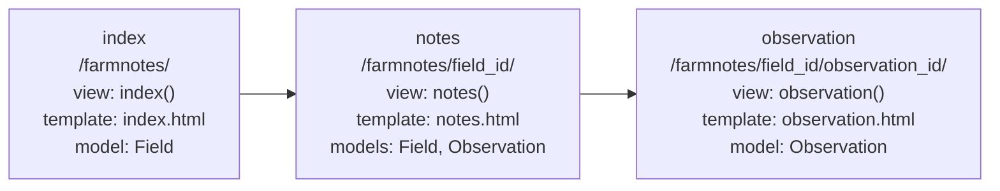

# Demo: from functions to Django models

ASM 532 - Module 4 - Lectures 4.1, 4.2 and 4.3

This is the demo from class. Poke around at your own pace. Nothing here is graded.

1. A notebook that walks through function design, then objects in Python, then the two classes that become the `farmnotes` app's models.
2. `myapp`, a Django project with one app, `farmnotes`: the Django setup from Lecture 4.2, and the views, templates, static files and fixture from Lecture 4.3.

## The notebook

Source file: [farm-oop-demo.ipynb](farm-oop-demo.ipynb)

To run it:

1. Open `farm-oop-demo.ipynb` in VS Code.
2. Select the `.venv` kernel you used in Lab 2 (no extra libraries are needed).
3. Run the cells in order, top to bottom.

The same steps as the lecture slides, one cell per step:
- functions with inputs, outputs, `*args`, and a docstring whose examples `doctest` runs as tests
- the `farm.py` read-along from Lecture 3.3: a reusable `Animal`, a `Goat` that inherits from it, methods, and a `Cow` that overrides `details()`
- `Field` and `Observation` as plain Python classes, then the same two as Django models

## The Django project

Source folder: [myapp/](myapp/)

The project from the lectures, finished:

- **Lecture 4.2:** `startproject myapp`, `startapp farmnotes`, the app registered in `settings.py`, both levels of URL mapping, and the `Field` and `Observation` models with their first migration.
- **Lecture 4.3:** three views (`index`, `notes`, `observation`) with their URL routes, a template for each in `farmnotes/templates/farmnotes/`, a stylesheet in `farmnotes/static/farmnotes/`, and a fixture with two fields and two observations in `farmnotes/fixtures/`.

### farmnotes site map

The app's three pages, each labelled with its URL, view, template and model(s). It's the same diagram as in Lecture 4.3, and a worked example for Lab 4's site map.



*In words:* the index page (`/farmnotes/`, view `index()`, template `index.html`, model `Field`) links to each field's notes page (`/farmnotes/field_id/`, view `notes()`, template `notes.html`, models `Field` and `Observation`), which links to each observation page (`/farmnotes/field_id/observation_id/`, view `observation()`, template `observation.html`, model `Observation`).

To run it, inside your `.venv`:

```bash
pip install "django>=5.2,<5.3"
cd myapp
python manage.py migrate
python manage.py loaddata farmnotes-data.json
python manage.py runserver
```

Then go to http://127.0.0.1:8000/farmnotes/ and click through to a field and an observation. The database file, `db.sqlite3`, is not included: `migrate` builds it, and `loaddata` fills it.
