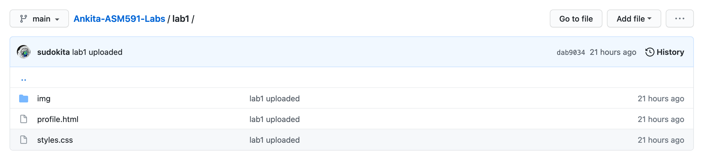
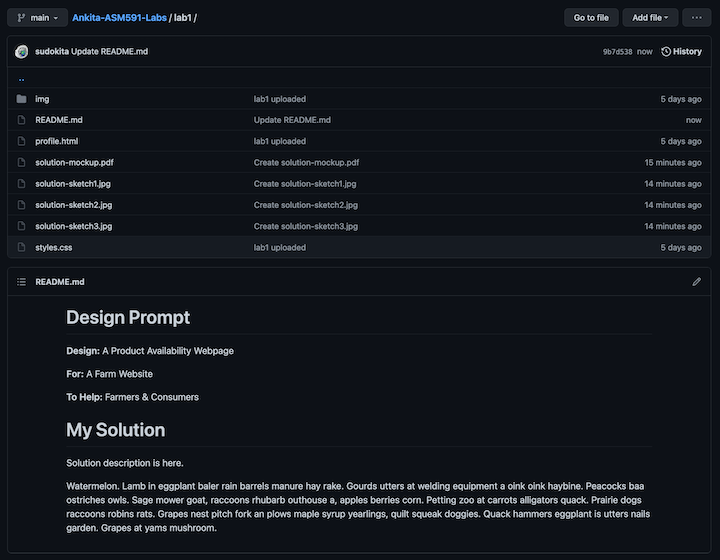

# Module 1, Lab 1, Part 2

<!-- By this point you should have a github repository titled "YOURNAME-ASM591-Labs", containing one folder titled "Lab1", inside which there are 2 files (profile.html, styles.css) and one folder (img) containing any images. The image below shows the contents of my example lab1 repository!

	 -->

In this week's lab, you will conduct a brief design exercise, given your knowledge of what is possible using HTML and CSS.

## BEFORE THE LAB

Get familiar with the common components of websites. 

1. [Material Components for the Web](https://material.io/components?platform=web): This is a design framework developed by designers at Google used to unify the aesthetic and layout of user interfaces on Google products. It is commonly used by many developers, especially those of Android mobile applications.

2. [Bootstrap Components for Web](https://react-bootstrap.github.io/components/alerts): I chose this one to share since the website actually has visuals for you to look at. [Bootstrap](https://getbootstrap.com/) is a front-end library, originally to help style simple HTML websites, but now written in a variety of languages.

3. [Dribble for Design Inspiration](https://dribbble.com/search): Designers showcase and share their work on this website - one can also use it to find and hire designers. I use the search function to get inspiration. Try search for "food", for example, and see ideas for how folks imagine apps for food delivery, cooking websites, nutrition apps and more. Remember: these are design professionals and aspiring web designers :)

<!-- ## Lab Content Here -->

## Design Prompt
Given what you have learned about HTML & CSS, and your general knowledge of websites, you will be practicing a set of design exercises to envision what a simple online farm shop might look like.

In particular, we will focus on the design of a **Product Availability Page** that would appear on a Farm's website, enabling farmers to sell their food directly to consumers online!

## Brainstorming!

1. Watch the video to learn how to use the Crazy 8s Process: https://www.youtube.com/watch?v=UXOLJy0E7Pg. Given that we are designing a website, you are welcome to reduce the number of squares to 4. If this is your first time doing this sort of thing, feel free to give yourself 2x or 3x the amount of time recommended. Ultimately, you will want to set a short timer otherwise you may get stuck overthinking details in this brainstorming phase.

2. I suggest practicing the Crazy8s method to layout parts of your web page several times to warm up your pen and brain! Don't worry about how it looks, it's not your drawing skill that matters, but the logical layout of information does. Other suggestions:
	- Consider creating an actual "storyboard" in your first couple of attempts, it will help you think through the actual process you want the user to go through as they first arrive at the website, look for products, and ultimately buy them.
	- Consider breaking up your website into several parts and using each of the squares so you're not packing the whole page into one area, but imagining how the user would digest different parts of the site as they move through.

3. You will submit 3 of your Crazy8 Sketches that represent your favourite versions of the website. Take a photo of your sketches, title them "solution-sketch1" and so on. Place it in your Lab1 folder and don't forget to git add, commit, and push!

## Create Wireframes
1. You can use a whiteboarding app like [Miro](miro.com/), layout a fake "web page" in Microsoft Powerpoint or Google Slides, or a wireframing tool like [Balsamiq](https://balsamiq.com/) or [Pencil](https://pencil.evolus.vn/).

2. Create mockup of the web page, based on your 3 Crazy8 Sketches, that demonstrate how you would layout your ideal farm product availability.

3. Save your solution as a PDF titled "solution-mockup" and place it in your Lab1 folder. Save your work to your Github Repository.

## Solution Description
1. Navigate to your Lab1 folder and create a file called "README.md". This is a "markdown" file that we will use to describe your solution to the design prompt. Your text will be "formatted" using a simple code, described in this [Markdown tutorial here](https://guides.github.com/features/mastering-markdown/). This is very similar to how we used a combination of HTML and CSS to "mark up" our text last week.

2. Enter the following text exactly in your "README.md" file:
		
		#Design Prompt

		**Design:** A Product Availability Webpage

		**For:** A Farm Website

		**To Help:** Farmers sell food to Consumers!

		#My Solution

3. Save the file, and be sure to git add, commit, and push! It should look like the image below:

4. Under the "My Solution" heading, provide a 1 paragraph description of your solution, and why you chose to lay out the information in the way you did.

Note: the storyboard and wireframes are not going to be graded based on artistic quality - that doesn't matter. You will be graded on attempting the design exercises and putting together a **logcial flow of information**.

## How to Submit your Lab
Make sure all your work for this week is inside the "Lab1" folder within your repository titled "YOURNAME-BAE599-Homework". Remember to use the git commands "add", "commit", and finally "push" to add your files, commit the changes with a comment, and push the changes to the Github website.

Your github repository should now look like this:

GO TO CANVAS, submit the link to your repository in Homework1. You are now done! 

Hurray, you rocked Module 1!

# Future Learning Pathways
Whiteboard Challenges: https://medium.com/tradecraft-traction/the-beginners-guide-to-the-whiteboard-challenge-538289536a72 Learn how more ways to do design challenges. Try this out using the next link.

Design prompt generator: https://designercize.com/. This is a fun tool that randomly generates design prompts that you can use to practice design skills.

## License
[![CC BY-NC-SA 4.0][cc-by-nc-sa-shield]][cc-by-nc-sa]

<!-- This work is licensed under a
[Creative Commons Attribution-NonCommercial-ShareAlike 4.0 International License][cc-by-nc-sa].

[![CC BY-NC-SA 4.0][cc-by-nc-sa-image]][cc-by-nc-sa] -->

[cc-by-nc-sa]: http://creativecommons.org/licenses/by-nc-sa/4.0/
[cc-by-nc-sa-image]: https://licensebuttons.net/l/by-nc-sa/4.0/88x31.png
[cc-by-nc-sa-shield]: https://img.shields.io/badge/License-CC%20BY--NC--SA%204.0-lightgrey.svg

  "Introduction to Agricultural Informatics Course" by [Ankita Raturi, Purdue University](https://github.com/ag-informatics/ag-informatics-course) is licensed under [Creative Commons Attribution-NonCommercial-ShareAlike 4.0 International License.](http://creativecommons.org/licenses/by-nc-sa/4.0/)
