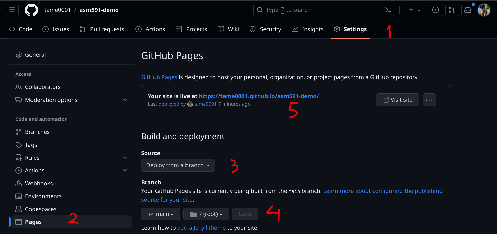

# Module 1, Lab 1, Part 1

## BEFORE THE LAB

Watch the CS50 [video on HTML](https://cs50.harvard.edu/web/2020/weeks/0/). THen, watch the CS50 [video on Git](https://cs50.harvard.edu/web/2020/weeks/1/). We will not be using Git as comprehensively as introduced in this video, but you will need to understand how to use the following commands at minimum:
- `git clone "url"` to clone a remote repository to your local machine
- `git pull` to pull changes to a remote repository
- `git init` to initialize a repository
- `git add .` to add all (".") changes here to my local version of the repository
- `git commit -m "message here"` to commit all your changes with a message
- `git push` to send all my local changes to the remote repository

#### Setup Git and Github:
- If you haven't already, create an account on [GitHub](https://www.github.com). If you already have a GitHub account, feel free to use it. We will be using github to share our code with each other - You'll recieve your labs this way, and I will expect you to submit your labs this way too.
- Install github on your computer using this [tutorial](https://github.com/git-guides/install-git).
Git vs GitHub

#### Setup Visual Studio Code (optional but highly recommended)
You are welcome to choose any editors or IDEs that you prefer. But we recommend using Visual Studio Code. It is an open-source multi-platform code editors (it means you can use with no cost and it is available in various platform e.g. Windows, Mac, or Linux). To install, check this [website](https://code.visualstudio.com/). From now, we will call Visaul Studio Code as "VS Code". 

## What are Git and GitHub? 

**Git** is a version control system that will keep tracking changes of your code. There are other version control systems, for example, [Subversion (SVN)](https://subversion.apache.org/) or [Mercurial](https://www.mercurial-scm.org/). However, Git is the most popular choice as it is easy to use and supported by many cloud source code hosting platforms. 

**GitHub** is a cloud platform to host your source code that using Git. It not only host your code, but also has multiple features for colaborating among developers, such as issues, discussions, or project boards. There are other platforms e.g. [GitLab](https://about.gitlab.com/why-gitlab/) or [Bitbucket](https://bitbucket.org/product). But GitHub is the most popular choice.  

## Use Git to access class materials (we'll do this in-class too!)

1. Open the terminal
	- For Windows: Search for `command prompt` or windows key + r then type cmd.
	- For Mac: Search for `terminal`.
	- For Linux: Search for `terminal` or ctrl + alt + t.

2. Navigate to the folder that you want to keep the class material repository. Use command `pwd` to check your current directory. Then use `cmd "folder_name"` to enter the folder or `cmd ..` to exit the folder. 

+ Tip: You can type a first few later of folder's name then press `tab` on your keyboard for autocompletion (the system will type the rest of the name automatically).

+ Tip 2: For Windows, you can use Windows Explorer to navigate to the directory that you want then type `cmd` on directory bar (where it shows the directory hierarchy).

3. Clone this repository using `git clone https://github.com/ag-informatics/ag-informatics-course`. You can view the repository URL by cliking on the green "Code" button. This command will clone the code from GitHub to your local repository while still linking with the cloud. Therefore, you can use another git command to update the clone folder. 

+ Note: You can download source code as a ZIP file. But it will be only a snapshot of the code at the moment you download. You will not be able to use any git commands in ZIP download repositories.
	

4. Every week, I will update this repository with new things. You can update your local repository by `git pull` the changes from the web. When you navigate to the folder containing the repository on your local machine, you will be able to see the changes.

## Create Your First Repository
In this module, you will create your profile page and host it on GitHub. So, first step is creating a new repository. You should be able to see a green "New" button in your "Repositories" tab on GitHub or you can click [here](https://github.com/new). For this lab, you have freedom to name your repository (you can always change it) and make this repository **<u>public</u>**. 

**Academic Integrity Reminder:** This is only lab that your Github repository is public. For lab 2 and the remaining of the class, the repository must be private.

Next Clone the repository to your local machine as you did in the [previous section](./README.md/#use-git-to-access-class-materials-well-do-this-in-class-too). Then you can choose File -> Open Folder in VS Code. Another option is using intregrated GitHub feature in VS Code. Click on the "Source Control" tab on the left panel (or ctrl + shift + g), then you will see an option to Clone Repository. You can either copy repository URL or allow VS Code to access your GitHub profile by clicking on "Clone from GitHub". You will need to go though the authentication processes. At the end, you will see a list of all repositories in your GitHub account. Choose the one that you just created. 

## Introduction to HTML and CSS

In this lab, you will create a basic webpage to demonstrate your understanding of HTML. 

**File Structure** 
- Create a file called "index.html". You will be making a basic web page to showcase your work.
- Create a file called "styles.css". This will contain all the CSS for your webpage. Make sure you link it in the "head" section of your index.html web page.
- Create a folder called "img", this will contain any images that you use on the webpage.

### Preview Your Webpage
You can open your HTML file on your prefer web brower (such as Chrome). Another option is using VS Code extension to render HTML webpage. You can install extension by clicking on "Extensions" on the left panel (or ctrl + shift + x). Searach for "Live Preview" by Microsoft. To open preview, first you will need to open VS Code command palette by press ctrl + shift + p then type "Live Preview: Show Preview". Alternatively, you can right click on the HTML file and choose "show preview" option. 

### Mockup
You will create state Profile Webpage that looks similar to the mockup below:

1. Create a `
` with the ID name "header". This division should contain introduction header text, e.g., "Hi! I'm Ankita". 
		- Give the header a minimum height (e.g., 40px).
		- Center the text within the header division.
		- Change the font style and size to something that is different from the rest of the page. 
		- Use CSS header to make your header text "small caps".

2. Create a `
` with the ID name "about".  This division should contain a photo of yourself with a description of what you do.

    a. In your styles.css file, add code to style this section as follows:
     - Photo has a black border of 2px. 
     - Change the description font and size to one of your choosing.
     
    b. Include at least 3 hyperlinks to your github repository and any other links you may want to share (e.g., Linked In). 
  	 - Select an "mail" icon from the Noun Project, available publicly [here](https://thenounproject.com/search/?q=mail). Use a "mailto" to activate my default mail client and send an email to you. 

3. Create a `
` with the ID name "work-samples". This division should contain a "flexbox", "table", or "grid" layout consisting of three sub-elements. Each sub-element should contain a placeholder image and some descriptive text of your work. 
	
	a. Your styles.css file should contain relevant styling for this section. At minimum:
	- Change the font style and size.
	
	b. You must use either an ordered or unordered list element to lay out the description text for each work sample. 
	- Use CSS to remove the bullet symbols.
	- Ensure that the text is vertically aligned with the image.

4. Create a `
` with the ID name "footer". This division should contain a footer with your name, and the date this page was last updated.
	- Use CSS to give the footer a solid background color. 

5. Your html and css files should contain the appropriate code to:
	
	a. Center your content in the browser.
	
	b. Use the correct "veiwport" to make your webpage "responsive", i.e. it should be scale for device size.

**Tips**: There are several resources that you can look for help 

- The CS50 [video on HTML](https://cs50.harvard.edu/web/2020/weeks/0/)
- Search for entire tutorials (e.g. [HTML](https://www.w3schools.com/html/default.asp) or [CSS](https://www.w3schools.com/css/default.asp) from [W3 School](https://www.w3schools.com/)) or specific questionsS
- Utilize Generative AIs such as [ChatGPT](https://chat.openai.com/auth/login) or [Bard](https://bard.google.com/)
- See [Future Learning](./README.md/#future-learning-pathways)

## Use Git to Submit Your Labs
It is a good practice that you commit after you make significant progress. It will help preventing bugs and if it happens, you can revert to the previous working version at anytime. I expect to see an appropriate number of distinct "commits" in your repository history per lab (i.e., >5 commits for lab 1.1 alone), with appropriate comments, demonstrating that you have been working on your project over a period of time.

To make a commit, open a terminal and navigate to the repository directory (the same method as you did when you clone the repository). Or you can use VS Code built-in terminal by clicking on "Terminal" on the top panel and then "New Terminal" (or ctrl + shift + `). If you use VS Code built-in terminal, you should be in the repository directory by default. 

Using command `git status`, you will see a list of files that have changed from the latest commit. You will need to select file(s) you want to track in this commit by `git add filename1 filename2 ...` (or you can add one file at a time or `git add .` to add all files). Then commit by `git commit -m "message here"`. At this point, the commit is recorded in your local machine. To update your cloud repository on GitHub, use command `git push`. You can make multiple commits locally or discard commits before you push to GitHub.

**note**: You might need to tell Git who is making commit by `git config user.name "your github username` and `git config user.email "your email"`. 

Alternatively, VS Code has a feature to make commits and push. Check "Source Control" tab on the left panel (or ctrl + shift + g). You should be able to see a list of files that have changed (`git status`). You can click on "+" to add file(s) (`git add`). Write the commit message then click "commit" (`git commit`). Then you will see an option to sync your repository with GitHub (`git push`).

## Hosting Webpage on GitHub

GitHub allows you to host static webpages from your repositories. We are going to host your profile webpage in this way. Follow the instructions below:

1. Click "Settings" tab on your repository
2. Look for a tab "Pages" on the left panel
3. Select "Deploy from a branch" option
4. Choose "main" branch and `/(root)` folder
5. You should see your website URL in a minute

Now you have your own personal webpage to share to the world!

**Note**: There are multiple options to deploy GitHub pages. In this lab, we deploy from a branch "main". GitHub will look for file `index.html` in root folder. You can choose to deploy from different branches or other folders. 

## Future Learning Pathways 

To learn more about Github by digging in here:
- [Basics on Git](https://git-scm.com/book/en/v2/Git-Basics-Recording-Changes-to-the-Repository)
- [Visualization of how git works](https://onlywei.github.io/explain-git-with-d3/#commit)
- [Full github training module](https://skills.github.com/)

To learn more about HTML and CSS, use these resources:
- [W3Schools HTML Reference](https://www.w3schools.com/tags/default.asp)
- [Mozilla Foundation HTML References](https://developer.mozilla.org/en-US/docs/Web/HTML)

## License
[![CC BY-NC-SA 4.0][cc-by-nc-sa-shield]][cc-by-nc-sa]

<!-- This work is licensed under a
[Creative Commons Attribution-NonCommercial-ShareAlike 4.0 International License][cc-by-nc-sa].

[![CC BY-NC-SA 4.0][cc-by-nc-sa-image]][cc-by-nc-sa] -->

[cc-by-nc-sa]: http://creativecommons.org/licenses/by-nc-sa/4.0/
[cc-by-nc-sa-image]: https://licensebuttons.net/l/by-nc-sa/4.0/88x31.png
[cc-by-nc-sa-shield]: https://img.shields.io/badge/License-CC%20BY--NC--SA%204.0-lightgrey.svg

  "Introduction to Agricultural Informatics Course" by [Ankita Raturi, Purdue University](https://github.com/ag-informatics/ag-informatics-course) is licensed under [Creative Commons Attribution-NonCommercial-ShareAlike 4.0 International License.](http://creativecommons.org/licenses/by-nc-sa/4.0/)
