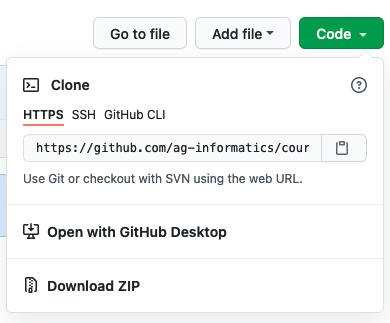
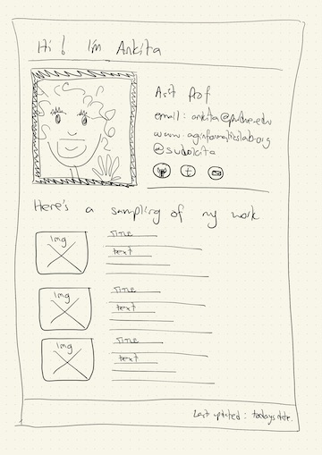
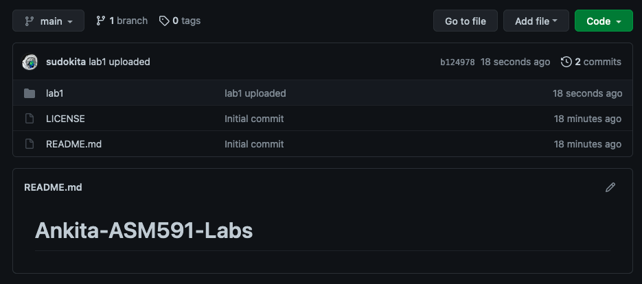

# Module 1, Lab 1, Part 1

## BEFORE THE LAB

Watch the CS50 video on HTML: https://cs50.harvard.edu/web/2020/weeks/0/

Watch the CS50 video on Git: https://cs50.harvard.edu/web/2020/weeks/1/. We will not be using Git as comprehensively as introduced in this video, but you will need to understand how to use the following commands at minimum:
- `git clone "url"` to clone a remote repository to your local machine
- `git pull` to pull changes to a remote repository
- `git init` to initialize a repository
- `git add .` to add all (".") changes here to my local version of the repository.
- `git commit -m "message here"` to commit all your changes with a message
- `git push` to send all my local changes to the remote repository.

## Use Git to access class materials (we'll do this in-class too!)
1. If you haven't already, create an account using your Purdue ID on www.github.com. We will be using github to share our code with each other - You'll recieve your labs this way, and I will expect you to submit your labs this way too.

2. Install github on your computer using this tutorial: https://github.com/git-guides/install-git

3. Clone this repository using `git clone https://github.com/ag-informatics/course.git'` You can view the repository URL here: 
	

4. Every week, I will update this repository with new things. You can update your local repository by `git pull` the changes from the web. When you navigate to the folder containing the repository on your local machine, you will be able to see the changes.

## Introduction to HTML and CSS

In this lab, you will create a basic webpage to demonstrate your understanding of HTML. 

**File Structure** 
- Create a folder titled "Lab1". 
- In this folder create a file called "profile.html". You will be making a basic web page to showcase your work.
- Create a file called "styles.css". This will contain all the CSS for your webpage. Make sure you link it in the "head" section of your profile.html web page.
- Create a folder called "img", this will contain any images that you use on the webpage.

### Mockup
You will create state Profile Webpage that looks similar to the mockup below:

1. Create a `
` with the ID name "header". This division should contain introduction header text, e.g., "Hi! I'm Ankita". 
		- Give the header a minimum height (e.g., 40px).
		- Center the text within the header division.
		- Change the font style and size to something that is different from the rest of the page. 
		- Use CSS header to make your header text "small caps".

2. Create a `
` with the ID name "about".  This division should contain a photo of yourself with a description of what you do.
  a. In your styles.css file, add code to style this section as follows:
     - Photo has a black border of 2px. 
     - Change the description font and size to one of your choosing.
  b. Include at least 3 hyperlinks to your github repository and any other links you may want to share (e.g., Linked In). 
  	- Select an "mail" icond from the Noun Project, available publicly here: <a href="https://thenounproject.com/search/?q=mail">https://thenounproject.com/search/?q=mail</a>. Use a "mailto" to activate my default mail client and send an email to you. 

3. Create a `
` with the ID name "work-samples". This division should contain a "flexbox", "table", or "grid" layout consisting of three sub-elements. Each sub-element should contain a placeholder image and some descriptive text of your work. 
	a. Your styles.css file should contain relevant styling for this section. At minimum:
		- Change the font style and size.
		- 
	b. You must use either an ordered or unordered list element to lay out the description text for each work sample. 
		- Use CSS to remove the bullet symbols.
		- Ensure that the text is vertically aligned with the image.

4. Create a `
` with the ID name "footer". This division should contain a footer with your name, and the date this page was last updated.
		- Use CSS to give the footer a solid background color. 

5. Your html and css files should contain the appropriate code to:
	a. Center your content in the browser.
	b. Use the correct "veiwport" to make your webpage "responsive", i.e. it should be scale for device size.

## Use Git to submit your labs
1. Create a new repository called "YOURNAME-ASM591-Labs". Mine would be, for example "Ankita-ASM591-Labs". You will create a subfolder for your lab submissions. If you have trouble contact me ASAP.
	- MAKE SURE THIS REPOSITORY IS "PRIVATE". See [Academic Integrity Statement](https://github.com/ag-informatics/ag-informatics-course#academic-integrity) in syllabus.
	- Add @sudokita (Ankita, Instructor) and @taanis98 (Aanis, TA) as collaborators on your repository so that we can access your work and grade it.
	- I expect to see an appropriate number of distinct "commits" in your repository history per lab (i.e., >5 commits for lab 1.1 alone), with appropriate comments, demonstrating that you have been working on your project over a period of time.

2. For this module's lab, place the folder containing your HTML code, "Lab1" into this repository. This will be the first part of your submission next week! You should see something like the screenshot below:

	

## Future Learning Pathways 

To learn more about Github by digging in here:
- Basics on Git: - https://git-scm.com/book/en/v2/Git-Basics-Recording-Changes-to-the-Repository
- Visualization of how git works: https://onlywei.github.io/explain-git-with-d3/#commit
- Full github training module: https://lab.github.com/githubtraining/introduction-to-github

To learn more about HTML and CSS, use these resources:
- W3Schools HTML Reference: https://www.w3schools.com/tags/default.asp
- Mozilla Foundation HTML References: https://developer.mozilla.org/en-US/docs/Web/HTML 

## License
[![CC BY-NC-SA 4.0][cc-by-nc-sa-shield]][cc-by-nc-sa]

<!-- This work is licensed under a
[Creative Commons Attribution-NonCommercial-ShareAlike 4.0 International License][cc-by-nc-sa].

[![CC BY-NC-SA 4.0][cc-by-nc-sa-image]][cc-by-nc-sa] -->

[cc-by-nc-sa]: http://creativecommons.org/licenses/by-nc-sa/4.0/
[cc-by-nc-sa-image]: https://licensebuttons.net/l/by-nc-sa/4.0/88x31.png
[cc-by-nc-sa-shield]: https://img.shields.io/badge/License-CC%20BY--NC--SA%204.0-lightgrey.svg

  "Introduction to Agricultural Informatics Course" by [Ankita Raturi, Purdue University](https://github.com/ag-informatics/ag-informatics-course) is licensed under [Creative Commons Attribution-NonCommercial-ShareAlike 4.0 International License.](http://creativecommons.org/licenses/by-nc-sa/4.0/)
