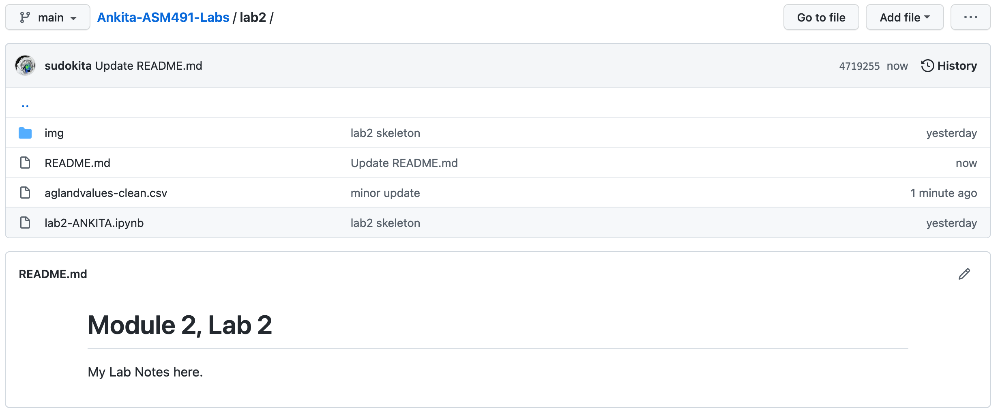
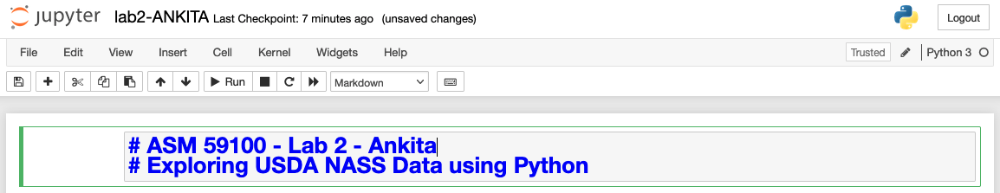
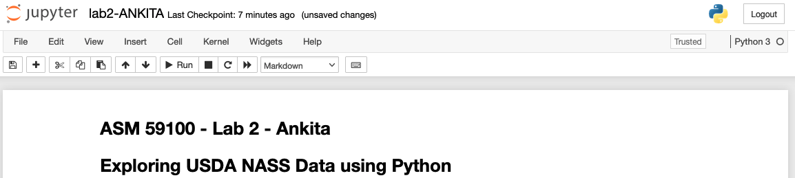
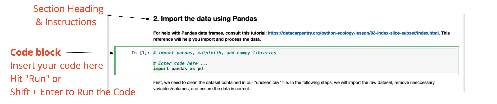
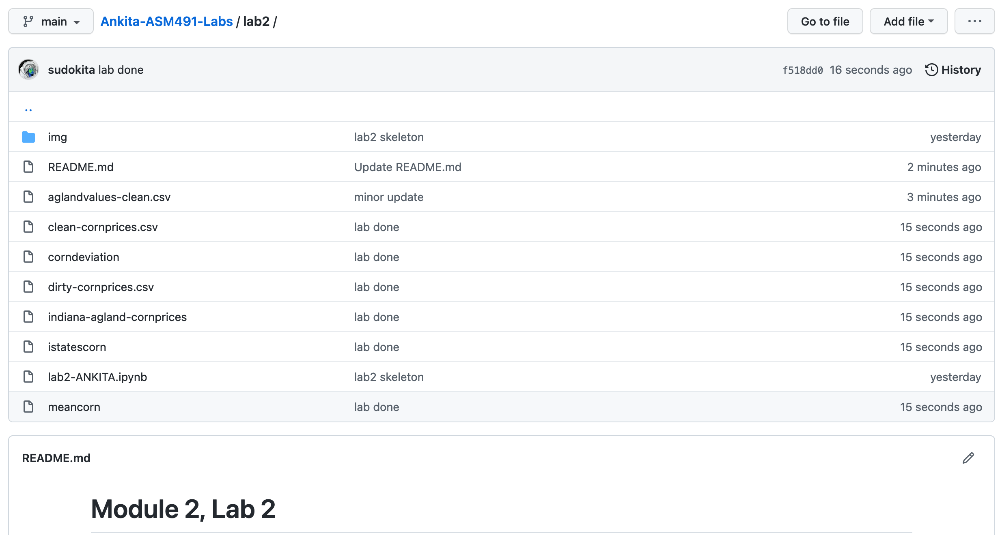

# Module 2, Homework 2

## BEFORE STARTING

**[Install Anaconda](https://www.anaconda.com/products/individual-d)** 
Anaconda is an all-in-one Python installer that downloads Python, Jupyter Notebooks, and a host of Python tools and packages. It serves as a unified Python installation, reducing the burden of package management and setting up your development environment. [Download it from the Anaconda website by clicking here.](https://www.anaconda.com/products/individual-d) It does not require admin rights on MacOS, but it does take a long time to run the final installation script, so don't be worried if it looks like it has locked up. [The Data Carpentry](https://datacarpentry.org/python-ecology-lesson/setup.html) provides a helpful installation guide in case you need it. 

**PYTHON INTRO/REFRESH!** 
If you are not familiar with Python, or need a quick refresher, do this 30 minute [Short Introduction to Programming in Python by the Data Carpentry](https://datacarpentry.org/python-ecology-lesson/01-short-introduction-to-Python/index.html).

**IMPORTANT TUTORIALS**
Anaconda automatically installs the Python packages that we will use in our assignment. Here are some basic tutorials for each of them:

1. [Jupyter notebook](https://jupyter.org/): An interactive python environment that allows you to run and view code in the browser. Here's a tutorial video on Jupyter Notebooks: 
    - We'll do a quick demo in-class.
    - **Go through this quick tutorial: https://datacarpentry.org/python-ecology-lesson/jupyter_notebooks/index.html.**
    - Full documentation: https://jupyter-notebook.readthedocs.io/en/stable/

2. [Numpy](https://numpy.org/): Python package for scientific computing. We're mostly going to use pandas and matplotlib, so the other materials cover what you need to know about numpy.

3. [Pandas](https://pandas.pydata.org/): Python package for data analytics. It's got an R/Matlab style feel to it. 
    - **Go through this 10 minute introduction to pandas: https://pandas.pydata.org/pandas-docs/stable/user_guide/10min.html.**
    - Full documentation: https://pandas.pydata.org/pandas-docs/stable/user_guide/index.html

4. [Matplotlib](https://matplotlib.org/): Python package for data visualization. 
    - **Quick start guide for matplotlib: https://www.python-graph-gallery.com/matplotlib/.**
    - You can consult the Data Carpentry Introduction to Matplotlib: https://datacarpentry.org/python-ecology-lesson/08-putting-it-all-together/index.html. 
    - Full documentation: https://matplotlib.org/stable/ with some introductory tutorials at: https://matplotlib.org/stable/tutorials/index.html#introductory

## Copy the Homework Skeleton File into your Repository
You should have previously cloned the class repository. Navigate to the "ag-informatics-course" repository folder on your computer. Use the command "git pull" to download all the new changes. You should now have a folder titled "module2", with a "HW2" folder inside it. It will contain this README.md file and a **"HW2-skeleton.ipynb" file** This file contains the instructions for your Homework. You will use it like a "worksheet", filling in the blanks wherever it prompts you with "Enter code here". 

Let's move this file into your repository for you to use:

1. Copy the "HW2" into your existing github repository titled "YOURNAME-BAE599-Homework".
2. Rename "HW2-skeleton.ipnyb" to "HW2-YOURNAME.ipnyb". **THIS IS THE FILE YOU WILL BE WORKING IN**
3. Replace the README.md file with your own. 
4. Git add, commit, and push so that your repository now contains these items.
5. View your new Jupyter Notebook in your github repository to confirm everything is in the right place. It should look like the image below.

## Open your Jupyter Notebook
1. Open Anaconda Navigator. 

2. Launch Jupyter Notebooks. A window will open in your browser that allows you to navigate to your repository folder > HW2. Click on "HW2-YOURNAME.ipnyb" and it will open in the a new tab.

3. Double click on the first block. The text color will turn blue, which indicates your editing that block. Add your name to the block as shown in the diagram below.

4. Click on the ">Run" button. This will execute that code block and render it as Markdown again. It will look like the image below. You've just successfully edited your first block!

5. From here on, follow the instructions in the notebook itself. The image below describes how you can interact with a Jupyter Notebook block:

6. Complete the entire set of tasks in the notebook. You will have two weeks to complete the entire thing.

## How to Submit your Homework
 Remember to use the git commands "add", "commit", and finally "push" to add your files, commit the changes with a comment, and push the changes to the Github website. Also remember, you should have a commit history with at least 5 commits to demostrate ongoing effort (don't just commit it all 5 mins before it's due!).

Once you have successfully completed all tasks for this homework, your HW2 folder should look like this in your github repository:

GO TO CANVAS, submit the link to your repository to your HW2 folder in your repository. You are now done! 

Hurray, you crushed Module 2!

## Future Learning Pathways 

To learn best practices for Data Organization in Spreadsheets: https://datacarpentry.org/spreadsheet-ecology-lesson/
To round out your skills in Data Analysis & Visualization in Python: https://datacarpentry.org/python-ecology-lesson/

## License
[![CC BY-NC-SA 4.0][cc-by-nc-sa-shield]][cc-by-nc-sa]

<!-- This work is licensed under a
[Creative Commons Attribution-NonCommercial-ShareAlike 4.0 International License][cc-by-nc-sa].

[![CC BY-NC-SA 4.0][cc-by-nc-sa-image]][cc-by-nc-sa] -->

[cc-by-nc-sa]: http://creativecommons.org/licenses/by-nc-sa/4.0/
[cc-by-nc-sa-image]: https://licensebuttons.net/l/by-nc-sa/4.0/88x31.png
[cc-by-nc-sa-shield]: https://img.shields.io/badge/License-CC%20BY--NC--SA%204.0-lightgrey.svg

  "Introduction to Agricultural Informatics Course" by [Ankita Raturi, Purdue University](https://github.com/ag-informatics/ag-informatics-course) is licensed under [Creative Commons Attribution-NonCommercial-ShareAlike 4.0 International License.](http://creativecommons.org/licenses/by-nc-sa/4.0/)
