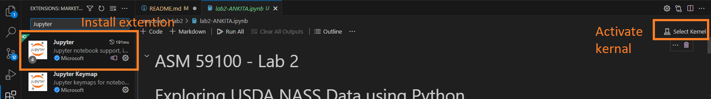
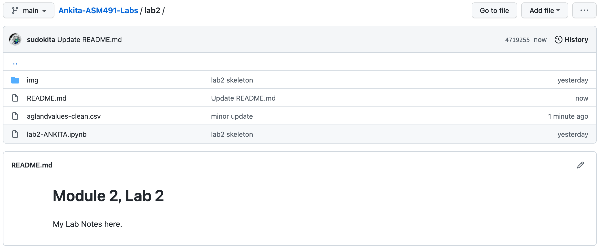
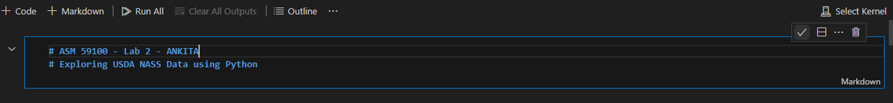
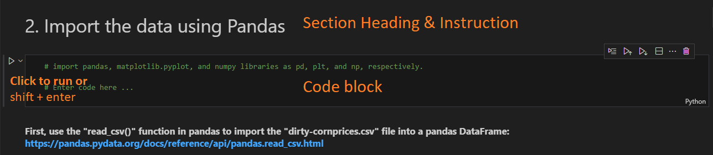
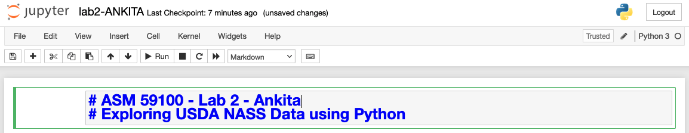
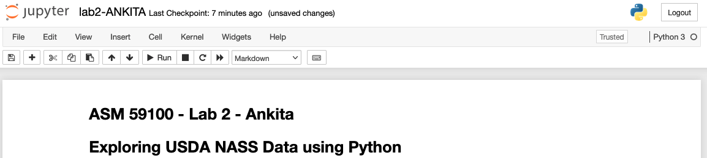
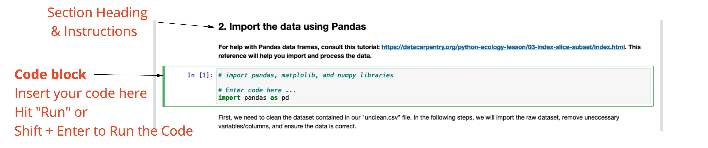
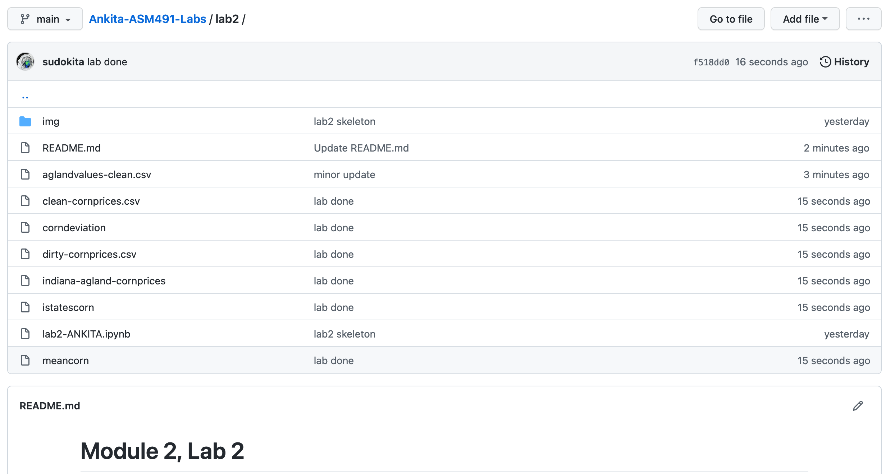

# Module 2, Lab 2

## BEFORE THE LAB

### Python virtual environment.

Software is evolving constantly. Python, for example, release a new version annually. New versions come with new features, in the same time, some existing features will be changed, deprecated, or removed. This nature of software development applies to over 100,000 Python's libraries. This can cause incompatible issues between Python and other libraries that required to run the code. For example.

- You try to run the code that you (or your colleague who graduated and left) wrote a few years ago.
- You try to run your code on another machine like high performance computer.

To prevent this issue, it is highly recommend to create virtual environments and record a list of required libraries. Therefore, you can be sure that you have a set of correct libraries whenever you need to run the code again. There are 2 main methods to create Python virtual environment.

1. Built-in virtual environment creator (venv)
2. Anaconda (or miniconda)

[Anaconda](https://www.anaconda.com/) is known for as a completed bundle for data science work. It comes with IDEs, such as, Jupyter Notebook or Spider. [Miniconda](https://docs.anaconda.com/miniconda/) is a minimal version of Anaconda. It is only a package manager without any IDEs. Anaconda (and miniconda) will create global virtual environments that accessible throughout your system. This is helpful if you would like to use the same environment for multiple projects. However, anaconda can be slow, especially when that environment has several libraries.

Venv (virtual environment) takes different approach. It will create a local virtual environment to specific project. Therefore, it works really fast.

In this lab, we recommend using venv. If you have not install Python before, follow below guide to install Python 3.12 (or Python 3.9 or newer).

- For Windows users, you can install Python by Microsoft Store or download from https://www.python.org/downloads/windows/
- For Mac users, download the installer from here https://www.python.org/downloads/macos/
- For Linux users, in most of the case, Python is installed by default. If your distro does not have Python, you can install by sources from here https://www.python.org/downloads/source/

### Create New Environment with venv

1. create a new file name `requirements.txt`. Then copy and paste following text

```text
numpy==2.1.*
pandas==2.2.*
matplotlib==3.9.*
Requests==2.32.*
Jupyter==1.1.1
```

2. Open command palette in VS code (View -> Command Palette). Then type `Python: Create environment`
3. Choose `venv`
4. Choose Python version (if you have multiple versions, choose the latest one)
5. Select `requirements.txt` as we created in the step 1 as dependency.

VS code will create a new virtual environment in `.venv` folder and install all libraries that we need. If you want to do this process manually, following these command

```bash
# for Linux and MacOS.
# for Winders change python3 to py or python
python3 -m venv .venv
# for Linux and MacOS.
source .venv/bin/activate
# for Windows use -> .venv\Script\activate
pip install -r requirements.txt
```

As .venv could be generated easily and it is machine specific, it is a good practice NOT to add it into GitHub. To do so, create a file name `.gitignore`, then add `.venv` into that file.

### Create New Environment with Conda

After you install Anaconda or Miniconda, you will be able to use `conda` command in your terminal. You will need to create a new Python environment for this lab. A Python environment is a sandbox of Python and its packages where you have power to choose their versions. You can create multiple environments that suits your projects (and they all can run in the same machine). For this lab, we will need to use these Python packages: `Numpy`, `Pandas`, `Matplotlib`, `Requests`, and `Jupyter`. Open the terminal and follow these steps.

1. Create a new environment. "-n" is telling that the following word is the "name" of the new environment.

```bash
conda create -n asm591
```

2. You can check that you have created a new environment by

```bash
conda env list
```

3. Next, you will activate the newly created environment. After running this command, you will see that the name of environment has been changed (from base to asm591).

```bash
conda activate asm591
```

4. Now, we are going to install Python packages.

```bash
conda install numpy pandas matplotlib requests jupyter
```

### Activate your environment

Now, you have a new environment for this lab. However, you must activate this environment before you can execute the notebook.

#### If you use VS Code and Jupyter extensions

- Click on "select kernel" on the top right corner. You will only see this button when you open a jupyter notebook file.
- If you have not selected any environment, when you run the notebook for the first time, VS Code will ask you to select the environment you want to activate.



#### If you use Jupyter that comes with Anaconda

Check the "kernel" tab then you can select your environments.

### PYTHON INTRO/REFRESH!

If you are not familiar with Python, or need a quick refresher, do this 30 minute Short Introduction to Programming in Python by the Data Carpentry: https://datacarpentry.org/python-ecology-lesson/01-short-introduction-to-Python.

### IMPORTANT TUTORIALS

Anaconda automatically installs the Python packages that we will use in our lab. Here are some basic tutorials for each of them:

1. [Jupyter notebook](https://jupyter.org/): An interactive python environment that allows you to run and view code in the browser. Here's a tutorial video on Jupyter Notebooks:

   - We'll do a quick demo in-class.
   - **Go through this quick tutorial: https://datacarpentry.org/python-ecology-lesson/jupyter_notebooks.**
   - Full documentation: https://jupyter-notebook.readthedocs.io/en/stable/.

2. [Numpy](https://numpy.org/): Python package for scientific computing. We're mostly going to use pandas and matplotlib, so the other materials cover what you need to know about numpy.

3. [Pandas](https://pandas.pydata.org/): Python package for data analytics. It's got an R/Matlab style feel to it.

   - **Go through this 10 minute introduction to pandas: https://pandas.pydata.org/pandas-docs/stable/user_guide/10min.html.**
   - Full documentation: https://pandas.pydata.org/pandas-docs/stable/user_guide/index.html.

4. [Matplotlib](https://matplotlib.org/): Python package for data visualization.

   - **Quick start guide for matplotlib: https://www.python-graph-gallery.com/matplotlib/.**
   - You can consult the Data Carpentry Introduction to Matplotlib: https://datacarpentry.org/python-ecology-lesson/08-putting-it-all-together.
   - Full documentation: https://matplotlib.org/stable/ with some introductory tutorials: https://matplotlib.org/stable/tutorials/index.html#introductory.

5. [Requests](https://requests.readthedocs.io/en/latest/): Python package to make HTTP requests. We will use only one function for this lab. Read "Make a Request" from this tutorial: https://requests.readthedocs.io/en/latest/user/quickstart/.

## Copy the Lab Skeleton File into your Repository

Create a new repository called "YOURNAME-ASM591-Labs". Mine would be, for example "Ankita-ASM591-Labs". You will create a subfolder for your lab submissions. If you have trouble contact me ASAP.

- MAKE SURE THIS REPOSITORY IS **"PRIVATE"**. See [Academic Integrity Statement](https://github.com/ag-informatics/ag-informatics-course#academic-integrity) in syllabus.
- Add @sudokita (Ankita, Instructor) and @tame0001
  (Tam, TA) as collaborators on your repository so that we can access your work and grade it.

You should have previously cloned the class repository. Navigate to the "ag-informatics-course" repository folder on your computer. Use the command "git pull" to download all the new changes. You should now have a folder titled "module2", with a "lab2" folder inside it. It will contain this README.md file and a **"lab2-skeleton.ipynb" file** This file contains the instructions for your lab. You will use it like a "worksheet", filling in the blanks wherever it prompts you with "Enter code here".

Let's move this file into your repository for you to use:

1. Copy the "lab2" into your existing GitHub repository titled "YOURNAME-ASM591-Labs".
2. Rename "lab2-skeleton.ipynb" to "lab2-YOURNAME.ipynb". **THIS IS THE FILE YOU WILL BE WORKING IN**
3. Replace the README.md file with your own.
4. Git add, commit, and push so that your repository now contains these items.
5. View your new Jupyter Notebook in your GitHub repository to confirm everything is in the right place. It should look like the image below.



## Open your Jupyter Notebook With VS Code

1. Open Jupyter Notebook file (lab2-YOURNAME.ipynb) in the VS Code. (Make sure you already install the extension)

2. Double click on the first block. The text color will turn blue, which indicates your editing that block. Add your name to the block as shown in the diagram below. Click on mark sign on the right when you finish editing.



3. From here on, follow the instructions in the notebook itself. The image below describes how you can interact with a Jupyter Notebook block:



4. Complete the entire set of tasks in the notebook. You will have two weeks to complete the entire thing.

## Open your Jupyter Notebook With Anaconda

1. Open Anaconda Navigator.

2. Launch Jupyter Notebooks. A window will open in your browser that allows you to navigate to your repository folder > lab2. Click on "lab2-YOURNAME.ipynb" and it will open in the a new tab.

3. Double click on the first block. The text color will turn blue, which indicates your editing that block. Add your name to the block as shown in the diagram below.



4. Click on the ">Run" button. This will execute that code block and render it as Markdown again. It will look like the image below. You've just successfully edited your first block!



5. From here on, follow the instructions in the notebook itself. The image below describes how you can interact with a Jupyter Notebook block:



6. Complete the entire set of tasks in the notebook. You will have two weeks to complete the entire thing.

## How to Submit your Lab

Remember to use the git commands "add", "commit", and finally "push" to add your files, commit the changes with a comment, and push the changes to the GitHub website. Also remember, you should have a commit history with at least 5 commits to demonstrate ongoing effort (don't just commit it all 5 mins before it's due!).

Once you have successfully completed all tasks for this lab, your lab2 folder should look like this in your GitHub repository:



GO TO BRIGHTSPACE, submit the link to your repository to your Lab2 folder in your repository. You are now done!

Hurray, you crushed Module 2!

**Academic Integrity Reminder:** Make sure your lab GitHub repositories are **"private"** for the duration of the course, to prevent others from simply copying your code. I trust that you will work independently, and will evaluate your work based on your "commit" history (i.e., you should NOT just commit the ENTIRE lab 5 minutes before the deadline). In general, writing code with the help of the internet is permissible, i.e., you can ask questions on Stack Overflow, discuss the problems with each other on Slack. Ultimately, I have a policy in which I trust that you are doing the right thing, unless I see evidence to the contrary.

## Future Learning Pathways

To learn best practices for [Data Organization in Spreadsheets](https://datacarpentry.org/spreadsheet-ecology-lesson/)

To round out your skills in [Data Analysis & Visualization in Python](https://datacarpentry.org/python-ecology-lesson/)

## License

[![CC BY-NC-SA 4.0][cc-by-nc-sa-shield]][cc-by-nc-sa]

<!-- This work is licensed under a
[Creative Commons Attribution-NonCommercial-ShareAlike 4.0 International License][cc-by-nc-sa].

[![CC BY-NC-SA 4.0][cc-by-nc-sa-image]][cc-by-nc-sa] -->

[cc-by-nc-sa]: http://creativecommons.org/licenses/by-nc-sa/4.0/
[cc-by-nc-sa-image]: https://licensebuttons.net/l/by-nc-sa/4.0/88x31.png

[cc-by-nc-sa-shield]: https://img.shields.io/badge/License-CC%20BY--NC--SA%204.0-lightgrey.svg

"Introduction to Agricultural Informatics Course" by [Ankita Raturi, Purdue University](https://github.com/ag-informatics/ag-informatics-course) is licensed under [Creative Commons Attribution-NonCommercial-ShareAlike 4.0 International License.](http://creativecommons.org/licenses/by-nc-sa/4.0/)
