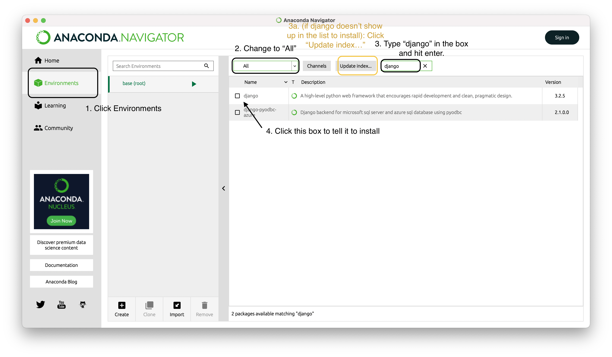
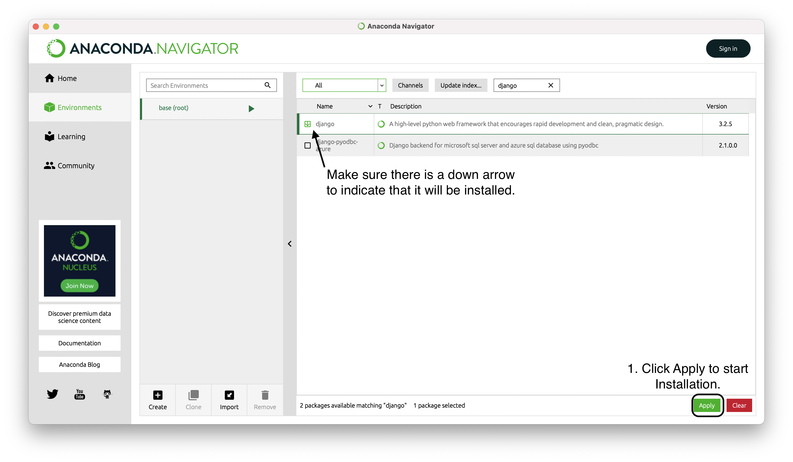
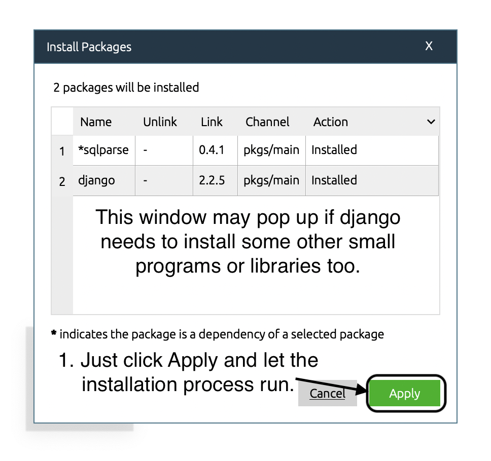
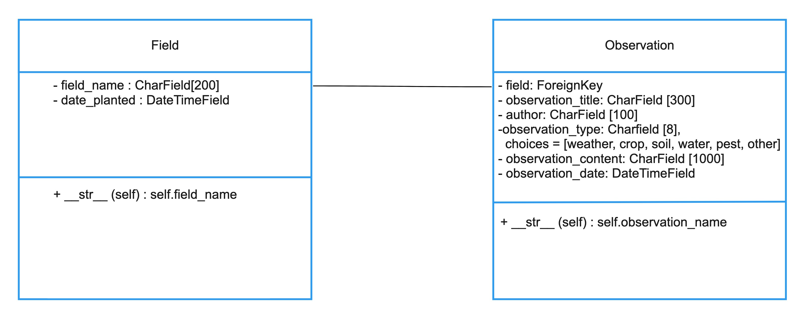
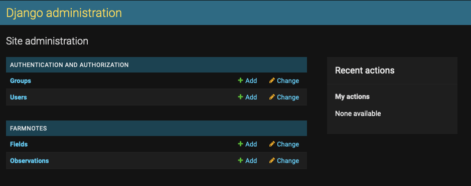
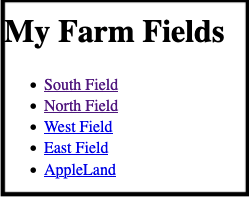
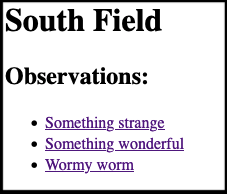
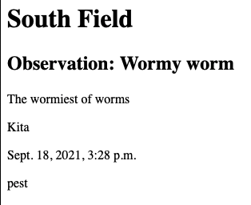
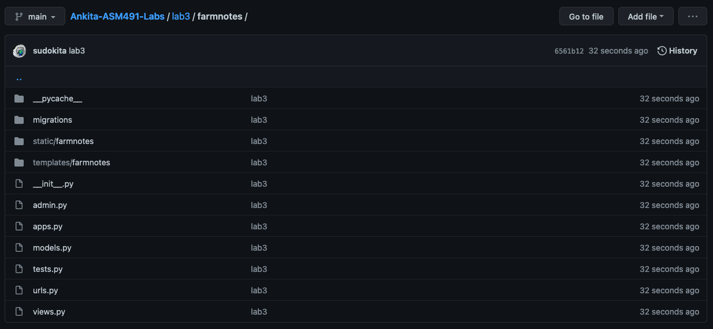

# Module 3, Homework 3

## START HERE
[Django](https://www.djangoproject.com/) is a python web framework that allows you to quickly develop web applications. This entire homeowrk is loosely based on a set of introductory Django tutorials, also available [here](https://docs.djangoproject.com/en/3.2/intro/tutorial01/). You're going to need a working installation of Python, the package manager 'pip', and finally, Django. 

### Install Django via Anaconda Termnial
A package manager is a tool that keeps a running list of all the packages associated with a particular language on your computer. You can use it to install, update, and remove different types of packages, or libraries. In the past, we had used Anaconda, a package manager with a nice user interface. This module, we'll use the `conda` command in the terminal to use the Anaconda package manager. (Note: ['pip'](https://pip.pypa.io/en/stable/) is a popular package manager for python, but since we started with Anaconda we'll stick with it. If you use pip, then follow [these instructions](https://docs.djangoproject.com/en/3.2/topics/install/#installing-an-official-release-with-pip) instead).

1. Open your terminal, and run the following command to install the 'django' package.

`conda install -c anaconda django`

2. Verify that python can see Django. In your terminal, type `python` to enter the python shell. Your terminal prompt will change to ">>>". If you haven't used this interface before, play around. You can run python commands just like we did in the Jupyter Notebook last week! Now you can import django and check the version installed by typing the following code in:

```python
import django
print(django.get_version())
```

### Install Django via Anaconda GUI
Anaconda Navigator also provides a GUI for package mangement. You can follow these steps to install django with the GUI.
Steps:
1. Click on Environments to switch to the Environment page.
2. Click on the package view filter and change to "All."
3. Type django in the package search box and hit enter.
 - If nothing appears, you may need to click on Update Index to refresh your package list (or build it for the first time).
4. Click the little box in front of django so that it changes to a down arrow

5. Click Apply to start the installation

6. A dialog box may pop up saying you need to install other programs or libraries, just click Apply again.

django should now be installed!

### Watch this tutorial video

Introduction to Django: https://cs50.harvard.edu/web/2020/weeks/3/

This tutorial covers some of the things we will do in this homework, plus a few extra things. I strongly recommend following along with the video as going through these concepts a couple of times will help you make sense of the framework and how the different files and components fit together.

### Do you have code editor?

If not, I recommend either [VS Code](https://code.visualstudio.com/) or [Sublime Text](https://www.sublimetext.com/).

## 1. Creating a skeleton web application
> This section is a customized version of [part 1 of this Django tutorial](https://docs.djangoproject.com/en/3.2/intro/tutorial01/).

### Create a 'HW' project

Open your terminal! Navigate to the place (using the `cd` command) where you would like to create your project. (In my examples, I have a "Code" folder that I put all my homeworks inside). We'll create a skeleton project called 'HW3'. You will upload everything inside this folder as part of your homework submission!

`django-admin startproject HW3`

The `django-admin` is our main command line tool for adminstrative tasks. We'll use this a fair bit in cojunction with other commands as you will see later. This first command automatically create a set of files that are your core project skeleton:
```
HW3/
  manage.py
  HW 3/
    __init__.py
    settings.py
    urls.py
    asgi.py
    wsgi.py
```

These files determine the way in which your python is "run". For now, we won't worry most of these files. I'll explain these as we begin to interact with them.

First, let's check that our project 'HW3' works. Run the following command:

`python manage.py runserver`

The first part, `python`, tells the terminal that we're about to run a python python file, in this case, we're running the python file `manage.py`.**[manage.py](https://docs.djangoproject.com/en/3.2/ref/django-admin/)** is itself a python-based command-line tool that can be used to run the django web server, manage the database, and range of other things. We pass the argument `runserver` to tell manage.py, that we'd like to activate the code required to... run the server!

```
Performing system checks...

System check identified no issues (0 silenced).

You have unapplied migrations; your app may not work properly until they are applied.
Run 'python manage.py migrate' to apply them.

September 17, 2021 - 15:50:53
Django version 3.2, using settings 'HW3.settings'
Starting development server at http://127.0.0.1:8000/
Quit the server with CONTROL-C.
```

If you go to the URL: http://127.0.0.1:8000/ in your browser, you should see a "Congratulations!" page. This means your django project works and is running on the server.

Once you're satisfied, hit CTL-C and stop the server.

### Create our "farmnotes" WEB APP

We're going to create a basic web appllication called **farmnotes** to allow a farmer to create quick observations and make notes about what they see as they are walking around their fields doing day to day activities. 

Make sure you're inside the 'HW3' folder. Run the following command:

`python manage.py startapp farmnotes`

As we run the manage.py tool this time, we provide the argument `startapp` followed by our app name `farmnotes`. This will create a skeleton web app inside the project folder 'HW3'. For future reference, remember that a project can contain multiple apps, hence the nesting.

Your 'farmnotes' *app* folder should look like this inside your 'HW3' *project* folder:

```
HW3/
  manage.py
  HW3/
  farmnotes/
      __init__.py
      admin.py
      apps.py
      migrations/
          __init__.py
      models.py
      tests.py
      views.py
  db.sqlite3
```

Start the server back up using `python manage.py runserver`.

If you go to the URL: http://127.0.0.1:8000/farmnotes in your browser, you should see an "404 Page not found" error page. Your django project is running, but your app is empty! Makes sense that it found no pages :)

### Create our first view

Open your project in an editor of your choosing. The **'views.py'** file contains python commands to "render" web pages.

Insert the following code into your **'HW3/farmnotes/views.py'** file:

**farmnotes/views.py**
```python
from django.http import HttpResponse

#Show all the fields in my farm
def index(request):
    return HttpResponse("Hello, world! You're at the farmnotes index, or 'home' page.")
```

Next we will map this file to URL. Inside **'HW3/farmnotes'** create a file called **'urls.py'**. Inside this file, insert the following code:

**farmnotes/urls.py**
```python
from django.urls import path

from . import views

urlpatterns = [
    path('', views.index, name='index'),
]
```

This file will be used to tell the server where different files are located. Django works by using a [URL dispatcher](https://docs.djangoproject.com/en/3.2/topics/http/urls/), a tool that tells the webserver how different URLs map to python functions (written inside views.py). So every time someone makes an HTTP request in the browser (by navigating to a URL), Django will point them to the correct python function that renders the appropriate web page, that is, the 'view'.

In this instance, we're pointing the server to the `index` function as specified inside the file 'views.py'. We now need to point the root URLconf file at the project level to this application.

Open the **'HW3/HW3/urls.py'** file. It will contain some code already, with two import statements and one item in the `urlpatterns` list regarding the admin site. Edit the file to import the package `include` from `django.urls` and add a line to route the server to the **'farmnotes'** app.

**HW3/HW3/urls.py**
```python
from django.contrib import admin
from django.urls import include, path

urlpatterns = [
    path('farmnotes/', include('farmnotes.urls')),
    path('admin/', admin.site.urls),
]
```

If you closed it, start the server back up using `python manage.py runserver`.

If you go to the URL: http://127.0.0.1:8000/farmnotes in your browser, you should see message saying "Hello, world! You're at the farmnotes index, or 'home' page.". Congrats! Technically, you've got a working Django web app. 

## 2. Creating the data model
> This section is a customized version of [part 2 of this Django tutorial](https://docs.djangoproject.com/en/3.2/intro/tutorial02/).

Now that we have a basic web application, let's create a structure to allow us to store and manage data. We'll dig into databases more closely in the next module, but we will cover the python side of data management in this module. 

In Django, a MODEL describes the structure of your data, as well as your database. Since models are written in python, we are essentially creating python OBJECTS, or CLASSESS, that Django processes and converts into the database itself. This means we don't actually leave python, even though we are in effect creating the model of a datbase.

### Create models to represent Fields and Observations.

>Creating the models is your first major knowledge check for this homework. I don't give you the answer but expect you to be able to convert the diagram to code given what we covered in class and in the associated review materials.

Open the **'models.py'**. Create two classes, one titled "Field" and one titled "Observation", based on the class diagram below.

**farmnotes/models.py**



HINT: You will need to create a tuple at the very top of your **'models.py'** file, so the first few lines of your file (before you start to write the code for your two classes), will look like the snippet below:

**farmnotes/models.py**
```python
from django.db import models

OBSERVATION_TYPES = [
  ('weather', 'Weather'), 
  ('crop', 'Crop'), 
  ('soil', 'Soil'), 
  ('water', 'Water'), 
  ('pest', 'Pest'), 
  ('other', 'Other'),
]

#class definitions below
```


Now, let's make sure that we register our **'farmnotes'** app with the **'HW3'** project. Navigate to the **'HW3/HW3/settings.py'**. In the section titled #Application definition, insert the line marked in the code below:

**HW3/HW3/settings.py**
```python
# Application definition

INSTALLED_APPS = [
    'farmnotes.apps.FarmnotesConfig',     ### ADD THIS LINE! Don't forget the comma :)
    'django.contrib.admin',
``` 

Once you are done, save the file and open your terminal. Make sure you are inside your Django 'HW3' project folder. Run the following command:

`python manage.py makemigrations farmnotes`

You will see a message similar to the following:

```
Migrations for 'farmnotes':
  farmnotes/migrations/0001_initial.py
    - Create model Field
    - Create model Observation

```

You've now created a set of instructions to Django stating that you'd like it to change your model, and store it as a *migration*. You can think of this step as the Django version of `git add` and `git commit`, where you are simply indexing the changes you'd like to make.

Next, run:

`python manage.py migrate`

Django will now actually alter your databse as instructed by your model: creating, editing, and deleting things as necessary. This is like the Django equivalent of `git push`-- it actually makes the changes you desire. 

If you made a mistake in your original model, just change it, run the `makemigrations` command to tell Django to make the changes, and run `migrate` to actually push the changes to the database. We'll dig into models more in the next module, but for now remember:

1. Edit your models in the file **'models.py'**
2. Run `python manage.py makemigrations farmnotes` to create the migration for the changes.
3. Run `python manage.py migrate` to push the changes to the database.

### Using the Django API
Django has an Application Programming Interface (API) that allows you to do things interactively. This will feel a lot like what we did in the Jupyter Notebooks module, where you interactively played with a Pandas dataframe. Instead, we'll be interactively playing with the Django model in your **'farmnotes'** application.

Run the command:

`python manage.py shell`

This starts puts us inside the application - more technically, the `manage.py` command sets the environment variable in python to be your Django application so you can import your newly created model and interact with your basic application. 

Try out the following commands. Remember anthing after the `#` symbol is a comment. You'll be typing in the commands written after the `>>>` prompts, and the response you get from python when you hit enter is shown below it.

```python
>>> from farmnotes.models import Field, Observation  # Import the model classes we just wrote.

# No fields are in the system yet so it returns an empty QuerySet
>>> Field.objects.all()
<QuerySet []>

# Create a new Field.
# We'll import use the timezone library, 
# so that we can use timezone.now() 
# to automatically detect the date and time right now.
>>> from django.utils import timezone
>>> myfield = Field(field_name="North Field", date_planted=timezone.now())

# Save the object into the database. You have to call save() explicitly.
>>> myfield.save()

# Now it has an ID.
>>> myfield.id
1

# Access model field values via Python attributes.
>>> myfield.field_name
"North Field"
>>> myfield.date_planted
datetime.datetime(2021, 9, 18, 3, 10, 37, 528878, tzinfo=<UTC>)

# Change values by changing the attributes, then calling save().
>>> myfield.field_name = "South Field"
>>> myfield.save()

# objects.all() displays all the questions in the database.
>>> Field.objects.all()
<QuerySet [<Field: Field object (1)>]>

```
When we called `objects.all()` requesting a list of all `Field` objects in the database, we got an unhelpful list -- what we wanted was the actual names of the field. This means we need to edit our model to actually have a **function** that returns `field_name`.

We'll use a special Django helper method, `__str__` to instruct our application to return a human readable representation of the model. 

Inside your `Field` class add the following code at the end:

**farmnotes/models.py**
```python
  def __str__(self): #this is the function declaration
    return self.field_name #and this will return the field name attribute

```

Inside your `Observation` class add the following code at the end:

**farmnotes/models.py**
```python
  def __str__(self):
    return self.observation_title

```

Try to run `Field.objects.all()` inside your app's shell (remember: `python manage.py shell`). You should now get a nice little list that includes the field name. Play around with creating and deleting objects inside your database via the shell!

### The Django Admin Portal

Django has a friendly little admin site already built into it, so we'll set that up for now so that we can play around with our data without worrying about the shell for now. Let's quickly set it up. This is a back-end tool, that is, this portal is not typically end-user facing. We will only use this to create test data and inspect our database.

In your terminal, make sure you are inside your **'HW3'** folder before you proceed. 

First, we need to set up a `super user`, that is, and admin account:

`python manage.py createsuperuser`

It will ask you to enter an admin username, email address, and password. We're not going to be deploying our site anywhere, so for now keep these simple. Remember, in the real world, this actually matters :)

Start your application's web server:

`python manage.py runserver`

Open http://127.0.0.1:8000/admin/ in your browser. You should see the admin login screen. Use your credentials to log in. It should look like this:


As always with Django, if you don't add it to the python model or view, it won't show up in the browser. So let's add our `Field` and `Observeration` models to the **'admin.py'** file by adding the following code:

**farmnotes/admin.py**
```python
from .models import Field, Observation

admin.site.register(Field)
admin.site.register(Observation)

```

Save your file. If you had left the server running, notice that your admin web page simply updated after you changed things. If not, spin the server back up and go to the admin site. It should now look like the image below:




Go ahead create at least 5 fields in the admin site. Create at least 10 observations, and associate them with different fields. This will populate our database with some test data as we continue. Use the admin page for ease of creation.

## 3. Creating the front-end

We will create a total of three views, or web pages, for our site:

1. Field `index` page - displays all the fields in my farm.

2. Field `notes` page  - displays all the observations related to a particular field.

3. A Field `observation` page - displays the details of a specific observation related to a field.

### Stub Views & Routing

We've already created a 'stub' (that is, a small piece of code that does a minimal set of actions) for our 'index' page view. We'll create each of these views in turn and iterate on our original 'index' view. Let's quickly put together a few more stubs so that we can set up the URLs for each of the pages.

Add the following view functions to **'farmnotes/views.py'**.

**farmnotes/views.py**
```python
#List all notes related to a particular field
def notes(request, field_id):
    return HttpResponse("You're looking at the notes related to field %s." % field_id)

#View the details of a single observation
def observation(request, field_id, observation_id):
        return HttpResponse("You're looking at observation %s related to field %s." % (observation_id, field_id))
```
Edit **'farmnotes/urls.py'** to look like the code snippet below:

**farmnotes/urls.py**
```python
from django.urls import path

from . import views

urlpatterns = [
    
    # /farmnotes
    path('', views.index, name='index'),

    # /farmnotes/field_id
    # /farmnotes/5/
    path('<int:field_id>/', views.notes, name='notes'),    

    #farmnotes/field_id/observation_id/
    #3rd observation for my 4th field
    #farmnotes/4/3/
    path('<int:field_id>/<int:observation_id>/', views.observation, name='observation'),
]
```

Let's try each of our web pages to make sure things are routing correctly.

1. Index page: 127.0.0.1:8000/farmnotes/

2. Field 1's notes page: http://127.0.0.1:8000/farmnotes/1/

3. Field 1, observation 1 page: http://127.0.0.1:8000/farmnotes/1/1/

Right now, our code's a little simplistic. For example, it doesn't check to see if there actually is an observation 1 for field 1, or do much of anything really. But, it does demonstrate that the URL routing works. Routing is how we point the HTTP request from the user to the correct Django view: a critical component of a Django application. 


### Real Views & HTML Templates!
Django uses [templates](https://docs.djangoproject.com/en/3.2/topics/templates/) to separate the design of the user interface from Python that manages the conversation between the front and back-end.

Insdie your create a folder called **'templates'** inside the **'farmnotes'** app folder. Becuase of how Djangos template loader functionality works, you'll have to create another folder inside **'templates'** that is the name of the app. Inside THAT you wil put your actual templates, in this case, create a file called **'index.html'**. Your folder structure will look something like this:

```
farmnotes/
  templates/
    farmnotes/
      index.html
  models.py
  views.py
  ...etc.
```

Confirm that your template path is: **'farmnotes/templates/farmnotes/index.html'**. Insert the following code into this template HTML file.

**farmnotes/templates/farmnotes/index.html**
```HTML
<!DOCTYPE html>
<html>
<head>
    <title>Farmnotes App</title>
</head>

<body>
    <h1>My Farm Fields</h1>
    
        <ul>
        
            <li><a href="/farmnotes/{{ field.id }}/">{{ field.field_name }}</a></li>
        
        </ul>
    
        <p>No fields are available.</p>
    
</body>
</html>

```
Some things to note:
1. The `` are the syntax for 'tags' in the Django template language ([here's a quick reference for it](https://docs.djangoproject.com/en/3.2/ref/templates/language/). It allows us to perform some logic e.g., loops to iterate through a list, like shown above in `for field in latest fields`. 

2. We can also use variables in our template. Consider the line `{{ field.field_name }}`. Anything inside `{{ }}` is a variable. In this case, we're calling the variable `field`, and specifically accessing the attribute `field_name`.

3. We've inserted a reference to a relateive URL inside around the `field.field_name` variable. It appears here: `<a href="/farmnotes/{{ field.id }}/">`. Think back to the **'urls.py'**. The format of this URL follows that! In this case, we are pointing to the `notes` URL and subsequently the notes function in views.py. The intent is that if the user clicks on the field name it takes them to the page that shows them all the notes for that particular field.

This **'index.html'** template, when rendered, should display a list of all the fields in our **'farmnotes'** database. But first, we need to update the python function `index()` inside **'views.py'** to point here correctly. 

**farmnotes/views.py**
```python
from .models import Field

#Show all the fields in my farm
def index(request):
    latest_fields = Field.objects.all()
    context = {'latest_fields': latest_fields}
    return render(request, 'farmnotes/index.html', context)
```
We use the function `render()`, a [Django shortcut function](https://docs.djangoproject.com/en/3.2/topics/http/shortcuts/#django.shortcuts.render). It has three arguments:
    - `request` which is the HTTP request object that was passed into the `index(request)` function in the first place.
    - the name of the template that we want to render, in this case `'farmnotes/index.html'`.
    - and an optional third argument: a dictionary referencing the object that we want to pass to the template. This allows us to pass the object `'lastest_fields'` from this view to the template as shown in the previous code block. That's how come we could use the argument `` in the **'index.html'** file. 

While your webserver is running, navigate to http://127.0.0.1:8000/farmnotes/. You should see output that looks like the image below. You can see the five fields I had created in the image (you won't have a black border, that's just the picture here). 

 


> Reminder: if you made any changes to your model, make sure you `makemigrations` and `migrate`, or you will get an error!

### 404 page not found errors 
Let's create field `notes` page  that will display all the observations related to a particular field. First, we will update the `notes` function inside our **'views.py'** file. In this case, we want the function to check to see if the field actually exists, otherwise throw a 404 page not found error. Let's look at two ways in which you can do it.

The long way would be...
```python
from django.http import Http404

def notes(request, field_id):
    try:
        field = Field.objects.get(pk=field_id)
    except Field.DoesNotExist:
        raise Http404("Field does not exist")
    return render(request, 'farmnotes/notes.html', {'field': field})

```
I show you this so that you can (a) see how one would typically use the `try` clause, and (b) see the `get` function in action since it allows us to actually obtain an object by passing the primary key, or ID of the object as an argument `pk=field_id`.

Since this is a common enough thing that people need to do, there is a Django shortcut function for it - `get_object_or_404()`. So we will actually use this instead. Edit the `notes` function in **'views.py'** as follows:

**views.py**
```python
from django.shortcuts import get_object_or_404

#List all notes related to a particular field
def notes(request, field_id):
    field = get_object_or_404(Field, pk=field_id)
    return render(request, 'farmnotes/notes.html', {'field': field})
```
Now you will practice what you've learned, and create the corresponding **'notes.html'** template file. Some tips:

1. The file will be placed in **'farmnotes/templates/farmnotes/notes.html'**. 

2. Similar to what we did in the **'index.html'**, you will need to iterate through the list of observations. However, given that we are passing the `field` object, we want to iterated through a set of all the observations related to a field, so you're going to need to use this `_set` helper. This concept is called [following a relationship 'backward'](https://docs.djangoproject.com/en/3.2/topics/db/queries/#following-relationships-backward).

3. Your final code will be approximately the same length as **'index.html'**, so if you find yourself writing much more, think simple, or ask us :)

4. Your final output will look like the image below (again, no a black border, that's just the picture here):



## View a single observation
Now that you've had experience with a few, try your hand at creating the `observation` function in **'views.py'** and the associated **'observation.html'** template file. You will not have to update anything else to get this page working. 

When I click on one of the links to an observation in the previous image, it should give me a detailed view of the observation. That is, when I visit the URL http://127.0.0.1:8000/farmnotes/1/1/, I should see the details of Field 1's Observation 1. Your page should display the following:

1. The name of the field
2. A prefix "Observation:" followed by the observation_title.
3. The observation_content itself.
4. The author of the observation.
5. The timestamp of when the observation was made.

It will look something like the image below:



## 4. Styling your web app

Inside your **'farmnotes'** folder: create a folder called **'static'**. Inside that, create a folder called **'farmnotes'**. Inside that create a file called **'style.css'**. (This is that same Django quirk we dealt with earlier when we created the templates folder). Inside your newly created stylesheet, enter a little color code so that we can test that everything works:

**farmnotes/static/farmnotes/style.css**
```css
body {
  background: green;
}
```

Go to your template files, and link the style sheet in the `<head>` section of **'index.html'**, **'notes.html'**, **'observation.html'**.
```HTML
    <head>
      <title>Farmnotes Application</title>
      
      <link rel="stylesheet" type="text/css" href="">
    </head>
```

Start your server (or restart it if it was already running). You should now see a green background.

Let's make each of the pages in our web app look a little better. You will have to edit the template files and CSS appropriately to make the following changes:

1. Create a solid colored header at the top of every page with the "Farmnotes" title. It should look the same across all pages.

2. Add a background image to the entire website. Your folder structure for the files will be like this: **'farmnotes/static/farmnotes/images/imagehere.png'**. The point is to figure out how to handle static files, so consider using a simple pattern image like those [found here](https://www.toptal.com/designers/subtlepatterns/).

3. Add a solid color background behind all the content on your webpage so that the text doesn't interfere with the background. 

4. Center all content on the webpage (like we did in week 1!)

## How to Submit your Homework
Remember to use the git commands "add", "commit", and finally "push" to add your files, commit the changes with a comment, and push the changes to the Github website. Also remember, you should have a commit history with at least 5 commits to demostrate ongoing effort (don't just commit it all 5 mins before it's due!).

You will submit your entire HW3 folder that contains all the code for your farmnotes app. Your file structure should look like this:

```
HW3/
  manage.py
  HW3/         ## I'm not showing what's in here becuase it shouldn't have changed since the beginning.
  farmnotes/
      static
        farmnotes
          style.css
          images
            background-image.png
      templates
        farmnotes
          index.html
          notes.html
          observation.html
      __init__.py
      admin.py
      apps.py
      migrations/
      models.py
      tests.py
      views.py
  db.sqlite3
```

Once you have commited to github, the **'farmnotes'** app folder (inside your **'HW3'** Django project folder) will look like this:



GO TO Canvas, submit the link to your repository to your HW3 folder in your repository. You are now done!

Huzzah, Module 3 has been conquered!

## Future Learning Pathways 

Mozilla server-side programming overview: https://developer.mozilla.org/en-US/docs/Learn/Server-side/First_steps/Introduction

Mozilla Django overview: https://developer.mozilla.org/en-US/docs/Learn/Server-side/Django

Full Django documentation (with tutorials!): https://docs.djangoproject.com/en/3.2/

## License
[![CC BY-NC-SA 4.0][cc-by-nc-sa-shield]][cc-by-nc-sa]

<!-- This work is licensed under a
[Creative Commons Attribution-NonCommercial-ShareAlike 4.0 International License][cc-by-nc-sa].

[![CC BY-NC-SA 4.0][cc-by-nc-sa-image]][cc-by-nc-sa] -->

[cc-by-nc-sa]: http://creativecommons.org/licenses/by-nc-sa/4.0/
[cc-by-nc-sa-image]: https://licensebuttons.net/l/by-nc-sa/4.0/88x31.png
[cc-by-nc-sa-shield]: https://img.shields.io/badge/License-CC%20BY--NC--SA%204.0-lightgrey.svg

  "Introduction to Agricultural Informatics Course" by [Ankita Raturi, Purdue University](https://github.com/ag-informatics/ag-informatics-course) and modified by Joe Dvorak, University of Kentucky, is licensed under [Creative Commons Attribution-NonCommercial-ShareAlike 4.0 International License.](http://creativecommons.org/licenses/by-nc-sa/4.0/)
