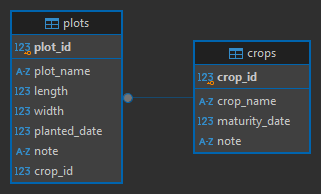

# Module 3, Lab 3

## BEFORE THE LAB

In this lab, we will use new software. To save time, please following sections below to install them before the lab.

### SQLite

If you are using MacOS, SQLite should have been installed by default. To verify installation, open terminal and type `sqlite3`. You should see the prompt showing the version number. To exit, type `.quit`.

For Windows users, go to [https://www.sqlite.org/download.html](https://www.sqlite.org/download.html), scroll down to "Precompiled Binaries for Windows" and download `sqlite-tools-win-x64-xxx.zip`. Extract the zip file and you will see `sqlite3.exe`, this is your sqlite command tool. You can either double-click or execute through terminal (PowerShell). To exit, type `.quit`.

For Linux users, you can install sqlite3 your OS package management. For example, if you are using Debian or Ubuntu family, run the following command

```
sudo apt install sqlite3
```

Then you can verify the installation by typing `sqlite3` in the terminal. YOu should see the prompt showing the sqlite version. To exit, type `.quit`.

<!-- ### DBeaver -->

### Create a folder for lab 3

You will to create a new folder call "lab3" in the same repository that you used in lab 2. Your repository should look like as below.

```
lab2            <-- previous lab submission
lab3            <-- new folder for this lab
README.md       <-- optional
```

## Farm Management application

We are going to create a basic version of farm management application by the end of this class. Each lab in module 3-6 will introduce you to new concepts that you will need to build the application. In this lab (module 3), we will start with the fundamental element: data model. However, farm is complicated and diverse. Thus, we will limit the complexity of the farm that we are going to build application for in this lab. The lab 3 farm is basic farm with empty land. Since, you plan to grow variety of crops, there will be too many things to remember. For example, which crops do you grow and how many of each? So, let's start with designing the crop tracking database. In the farm, you will divide the land into multiple plots. In each plot, we will record following information

- plot name
- length
- width
- planted date
- crop
- note

Each plot will have only 1 crop. But one crop can by planted in many plots. Therefore, in the plot table, `crop` attribute (or column) will be a **foreign key** pointing to another table. In our case, that another table is crop table which will have following columns

- crop name
- maturity date
- note

Therefore, our data model will have two tables. The Entity Relationship Diagram is below. Now, it is time to create them.



1. We need to create a new database. Starting by activate sqlite engine (as installed in the [section above](#sqlite))
2. Type `.open [path-to-lab3]/crop_record.db`. You can optionally add `path-to-lab3` (e.g. `.open D:/class/Tam-ASM532-Labs/lab3/crop_record.db`). Otherwise, you can just ignore path (just type `.open crop_record.db`). It will create a new database file in your terminal current location. (or open the database file, if you created earlier).
3. Type `.tables`. You should see nothing as we have not created any tables.
4. Type

```
create table crops (                        <-- create a new table name "crops"
    crop_id integer primary key,            <-- the first column is "crop_id", data type is integer (whole number) and it is the primary key
    crop_name text not null,                <-- the second column is "crop_name", data type is text (or string) and it cannot be null
    maturity_date integer not null,         <-- the third column is "maturity_date", data type is integer and it cannot be null
    note text                               <-- the last column is "note", data type is text, it could be null
);
```

Now, if you type `.tables` you should see one table as a return value since we just created it. Each table must has primary key column. Imagine as you open an excel spreadsheet, you will see a running number on the left as a row number. Primary key acts as row number for the table in any databases. Other two columns have `not null` as a condition. This condition prevents inserting row with null (blank) into these columns. The database engine will reject inserting operations. See this [tutorial](https://www.sqlitetutorial.net/sqlite-create-table/) for more detail about creating new tables.

5. To see the data inside the table, type `select * from crops;`. You should see nothing in return as we just create a new table.
6. Type

```
insert into crops (crop_name, maturity_date)
values (carrot, 70);
```

The command above will insert a row to table `crops` with two column `crop_name` with value "carrot" and `maturity_date` with value 70. Note that, you don't need to add value to column `crop_id` as it is a primary key. So, this column is managed by the database engine. You don't need to specify value for `note` column as it is optional (it does not have `not null` constraint).

7. You can type `select * from crops;`. This time, you will see a row as return value.
8. Your task is to insert at least 4 more rows into crops table. You can choose any crops you want. You don't need to worry about researching for accurate maturity date. Any reasonable numbers will be accepted. At least 2 rows must have values in `note` column. Record your insert commands in `insert_plots.txt`.

We created crop table. Next, we will create plot table. As mentioned earlier, we will link crop table and plot table together using foreign key. Foreign key is one of the key principle of any relational databases. It helps to links multiple tables together, reduces duplicates information, improves query efficiency etc. Please take a look in this [tutorial](https://learnsql.com/blog/why-use-foreign-key-in-sql/) for more explanation and example. You task is to create plot table. Here is the some help.

1. We need to enable foreign key functionality by typing this command `PRAGMA foreign_keys = ON;`
2. Next, use the code snippet below to create table. The snippet is not completed yet. You will need to fill missing parts indicating by "????".

```
create table plots (                                    <-- create a new table name "plots"
    ???                                                 <-- the first column should be the primary key (plot_id)
    ???                                                 <-- next is plot name
    ???                                                 <-- create column for length, width, planted_date, and note (use data type integer for plant_date column)
    crop_id integer not null                            <-- this column will be the foreign key to crop table
    foreign key (crop_id) references crops (crop_id)    <-- enforce foreign key constraint
);
```

You can check if plot table is created successfully or not by using command `.tables`. This command will list all tables. Now, we are going to insert a new row to the plot table.

```
insert into plots (plot_name, length, width, planted_date, crop_id)
values ('north plot', 20, 5, '2024-05-15', 1);
```

The above command will create a new plot name "north plot" with dimension of 20x5. The plot has carrot that planted on May 15, 2024. Like inserting to crop table, you don't need to specify plot_id, as it is the primary key and will be automatically managed by the database engine. The note column is optional. Planted_date column must follow `yyyy-mm-dd` format. Lastly, from crop table, you know that crop_id = 1 is carrot. Your task is to insert at least 9 more rows into plot plot table. At least 5 rows must have value in the `note` column. Record your insert commands in `insert_plots.txt`.

Hint: you can view data in the plots table by `select * from plots;`.

## Python and SQLite

So far, the commands that you used to create tables and insert rows were in the language SQL. This is a powerful and useful language. You can use this language with other SQL databases (eg. PostgreSQL, MySQL, Oracle). But as you may notice, it is not the most user-friendly language to use. In this section, we will use Python to interact with the database. first, copy `Lab3-skeleton.ipynb` and `data_model.py` from class repo -> module3 -> lab3 into your submission folder. Then rename it to `Lab3-yourname.ipynb`. Next open the Jupiter notebook file (.ipynb) and activate the kernel that you used in the lab 2 (it should be ".venv"). From now, you will follow the instructions in the Jupiter notebook.

## How to Submit your Lab

Remember to use the git commands "add", "commit", and finally "push" to add your files, commit the changes with a comment, and push the changes to the Github website. Also remember, you should have a commit history with at least 5 commits to demonstrate ongoing effort (don't just commit it all 5 mins before it's due!).

You will submit your entire lab3 folder that contains all the code. Your file structure should look like this:

```
lab3/
    crop_record.db          <-- The database for crops and plots table
    insert_plots.txt        <-- Commands that you used for inserting rows into crops table
    insert_crops.txt        <-- Commands that you used for inserting rows into plots table
    Lab3-yourname.ipynb     <-- Copy lab3-skeleton and change the name
    data_model.py           <-- Your data model
```

GO TO BRIGHTSPACE, submit the link to your repository to your Lab3 folder in your repository. You are now done!

Huzzah, Module 3 has been conquered!

## License

[![CC BY-NC-SA 4.0][cc-by-nc-sa-shield]][cc-by-nc-sa]

<!-- This work is licensed under a
[Creative Commons Attribution-NonCommercial-ShareAlike 4.0 International License][cc-by-nc-sa].

[![CC BY-NC-SA 4.0][cc-by-nc-sa-image]][cc-by-nc-sa] -->

[cc-by-nc-sa]: http://creativecommons.org/licenses/by-nc-sa/4.0/
[cc-by-nc-sa-image]: https://licensebuttons.net/l/by-nc-sa/4.0/88x31.png

[cc-by-nc-sa-shield]: https://img.shields.io/badge/License-CC%20BY--NC--SA%204.0-lightgrey.svg

"Introduction to Agricultural Informatics Course" by [Ankita Raturi, Purdue University](https://github.com/ag-informatics/ag-informatics-course) is licensed under [Creative Commons Attribution-NonCommercial-ShareAlike 4.0 International License.](http://creativecommons.org/licenses/by-nc-sa/4.0/)
