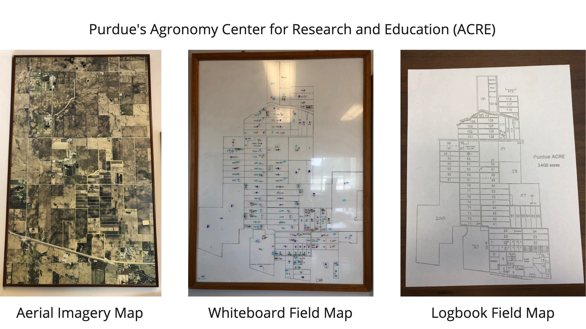

# Module 4, Lab 4

## BEFORE THE LAB

### Tutorial Video

Watch following tutorials:

- Introduction to Django: https://cs50.harvard.edu/web/2020/weeks/3/.
- SQL, Models, and Migrations: https://cs50.harvard.edu/web/2020/weeks/4/

Then visit the [django-example](../django-example/) folder (under module4 folder). You will find Django installation instructions and example projects. It is highly recommend to finish installation and follow the tutorials before start working on this lab.

### UML Modeling Tool

We'll be making little class diagrams. you can try:

- Creately: https://creately.com/lp/online-class-diagram-tool/
- Visual Paradigm: https://online.visual-paradigm.com/app/diagrams/#diagram:proj=0&type=ClassDiagram
- Whatever drawing tool you prefer.

### Lab Submission Folder Structure

You will be submitting a few different things. Create a folder called **'lab4'**. Create a subfolder called **'images'**. You will be uploading screenshots and diagrams throughout this lab into this folder. You will need to give each image the appropriate filename so that we know what it is. You will also create a README.md file that describes your solution. Use this [Github Markdown Reference Guide](https://guides.github.com/features/mastering-markdown/) to make sure your description is correctly formatted. You will, for example, want to include the image of your data model and final app in the README.md file (we'll describe this later).

```
lab4/
  images/
  ACRE/         # Don't create this folder yet, this shows where the Django project you create later will live.
  README.md
```

## 1. Problem Statement

[The Agronomy Farm](https://ag.purdue.edu/agry/acre/Pages/default.aspx) (AKA ACRE) is a 1600 acre research and education farm and facility about 7 miles northwest of the Purdue West Lafayette Campus. Over 50 researchers, from 8 departments are running approximately 180 research projects at ACRE, ranging from plant breeding and genetics, to serving as a testbed for digital agricultural technologies. When fields are not in research use, the they put into production, with the ACRE team growing commodity corn and soybean. Rachel Stevens, the farm manager, works with three full-time technicians and a team of seasonal and student labor as needed.



**Data Management Challenge:** The farm manager has has decades of historical farm operations data per field in logbooks like the one shown below:


The farm manager wants a web application in which all her historical field data resides in a logically structured database that allows for easy searching and exploration of the data. She also a password-protected dashboard that her workers can use to input new data into the the application. **In this lab, you will create a data management Django web application for the ACRE farm management team.**

> README.MD: In your lab's README.md file, under the heading "Project Overview", answer these two questions (briefly):

1. What is the goal of the proposed web application?
2. Who are the primary users, and what will each of them need to be able to do.

## 2. Designing the Data Model

Start by look at [data](./data/) folder. You will see a comma separated value files (.csv). The file will contains the operation log in a form of table. This is going to be the initial data we will use in the web application.

Explore the sample ACRE dataset: design a data model that considers logical groupings of data entities into Django `classes` and attributes.

Consider the first row, the operation data was April 24, 2022. Even used Hagie STS12 to spray 2-4D round up on field 200.

Thus, we can glean the following data from the entry:

- Field number: 200
- Date of operation: 4-24-2022
- Worker: Evan
- What was done: Spraying 2-4D

Take a look on more data sample and find the connection. Your task is to create a data model for the ACRE production farm operations data set.

You will draw a simplified UML class diagram as we have previously done in class that represents your proposed application based on this dataset. Focus on the design of the _data model_, that is, the components of the class diagram that represent the data itself. This diagram will determine what classes you will need to create in your Django app for this lab.

Your data model should have the following:

1. Consist of at least 4 classes.
   - For any attribute that is a "look up" list (e.g., a choice from a fixed set of options like operations), you must specify the lookup list.
   - Each class must have a primary key.
   - If you know what functions you may need to write, feel free to specify them. These are optional for now.
2. There must be a relationship between your classes.
   - Relationships will need to be represented through a foreign key attribute.

> IMAGE UPLOAD: Save your data model with the filename **'data-model'** inside your **'lab4/images'** folder.

> README.MD: Under the heading "Data Model", do the following:

1. Insert the image of your data model
2. Describe what each of the classes represent and how they related to each other.
3. Describe why you chose to model the data in this manner.

> README.MD Under the heading "Data Dictionary", you will have a table that describes each of the terms in your data model (keep the headings the same). An example of a data dictionary is shown in the table below (yours might be different).

| Variable     | Scope            | Description          | Acceptable Values | Data Type |
| ------------ | ---------------- | -------------------- | ----------------- | --------- |
| field_number | Class            | ACRE field ID Number | >0                | int       |
| field_name   | Field, Attribute | Name of the field    | 50 characters     | String    |

## 3. Initialize the Project & Application

Initialize a project titled **'acre'**.
Within this project, initialize an app titled **'acrelog'**.

Make sure you create a **'urls.py'** file inside acrelog, as well as required sub-folders (e.g., for templates).

Create a stub template file called **'index.hml'**, and add the corresponding `index` function in **'views.py'**. You will also need to add a route to this file, just like we did in the previous module. Display a message like "hello world" via your `index` stub to test that you have connected all the pieces together.

Your app folder should look like this:

```
acre/
  manage.py
  acre/
  acrelog/
      migrations/
      templates/
        index.html
      __init__.py
      admin.py
      apps.py
      models.py
      tests.py
      urls.py
      views.py
  db.sqlite3
```

Start the server and visit http://127.0.0.1:8000/acrelog to confirm that you have a working application.

> IMAGE UPLOAD: Take a screenshot of your working application with the filename **'hello-world'** inside your **'lab4/images'** folder.

## 4. Implement the Data Model & Import the data

First, implement your models in the **'models.py'**. Create a couple of test data entries through either the Django API or the admin dashboard as we previously did in class.

> IMAGE UPLOAD: Take a screenshot of your admin dashboard showing that you have successfully created a few data entries in your application. Upload with the filename **'test-data'** inside your **'lab4/images'** folder.

Next, you will need to bulk import some of the data into your application.

In Django, a ["fixture" file](https://docs.djangoproject.com/en/5.1/howto/initial-data/) can be used to provide initial data to a model. For example, let's say you have a spreadsheet and want to import that data into your Django app, doing it manually would take a long time. Ideally, you'd write a python script to convert the spreadsheet into a "fixture" file, that is a specially marked up data file, that Django then reads to know how and where to put the data.

In your Django app, create a folder called **'fixtures'** and place it in the app directory (so it should be in the same location as **'models.py'**).

In this JSON ["fixture" file](https://docs.djangoproject.com/en/5.1/howto/initial-data/), create the structure shown below. In the first code block I have provided an template. The second code block is an example. BE CAREFUL: the commas, colons, {} and [] brackets are all important! Missing one, can cause the whole thing to break. You can use (this JSON file validation tool)[https://jsonlint.com/] to check to see if your JSON vile is correctly structured.

```JSON
[
  {
    "model": "myapp.classname",
    "pk": 1,
    "fields": {
      "attribute_name1": "Value",
      "attribute_name2": "Value"
    }
  },
  {
    "model": "myapp.field",
    "pk": 2,
    "fields": {
      "field_id": "32",
      "field_name": "Corner"
    }
  }
]

```

Open your terminal and run the command:

```python
  python manage.py loaddata acre-data.json
```

Once you have run this command, open your Django app's admin dashboard. Your data should now appear in your database!

Please see this [guide](./data/loaddata-guide.ipynb) for how to create fixture files.

You might have multiple fixture files or have multiple versions of them. In some cases, you will build a couple of classes then adding more later. You can always reset your database by removing `migrations` folder in `acrelog` and `db.sqlite3`. You can create a new database by running migration again. As long as you create fixture files correctly, the import data process should cost only a few commands.

## 5. Create Views for Data Exploration

Create a set of very basic set of views and their corresponding template files (similar to the list views from last module) that allow a user to:

1. View the list of fields in the ACRE database in your **'index.html'** page.
2. View a single field: chronological list of all farm operations in a **'fields.html'**.

> IMAGE: Take a screenshot a single filed that contains several data entires. This should correspond to the second view you created. Save it with the filename **'sample-view'** inside our **'lab4/images'** folder.

## How to Submit your Lab

Your final lab submission should contain the following files (if your images are another file type that's OK!):

```
lab4/
  README.md                   <-- you should have all the pieces described in lab here
  images/                     <-- images you've uploaded
    data-model.png
    hello-world.png
    sample-data.png
    sample-view.png
  acre/                       <-- your Django project
    manage.py
    acre/
    acrelog/                  <-- your Django APP
        fixtures/             <-- you created everything in here
          acre-data.json
        migrations/
        templates/            <-- you created everything in here
          index.html
          fields.html
        __init__.py
        admin.py
        apps.py
        models.py             <-- contains your models
        tests.py
        urls.py               <-- contains your URL routes
        views.py              <-- contains your views
    db.sqlite3
```

GO TO BRIGHTSPACE, submit the link to your repository to your Lab4 folder in your repository. You are now done!

Holy moly, this was a curly one. You did it!

## Future Learning Pathways

Learn more about django models and databases: https://docs.djangoproject.com/en/5.1/topics/db/#

Specifically about SQL queries in Django: https://docs.djangoproject.com/en/5.1/topics/db/sql/

## License

[![CC BY-NC-SA 4.0][cc-by-nc-sa-shield]][cc-by-nc-sa]

<!-- This work is licensed under a
[Creative Commons Attribution-NonCommercial-ShareAlike 4.0 International License][cc-by-nc-sa].

[![CC BY-NC-SA 4.0][cc-by-nc-sa-image]][cc-by-nc-sa] -->

[cc-by-nc-sa]: http://creativecommons.org/licenses/by-nc-sa/4.0/
[cc-by-nc-sa-image]: https://licensebuttons.net/l/by-nc-sa/4.0/88x31.png

[cc-by-nc-sa-shield]: https://img.shields.io/badge/License-CC%20BY--NC--SA%204.0-lightgrey.svg

"Introduction to Agricultural Informatics Course" by [Ankita Raturi, Purdue University](https://github.com/ag-informatics/ag-informatics-course) is licensed under [Creative Commons Attribution-NonCommercial-ShareAlike 4.0 International License.](http://creativecommons.org/licenses/by-nc-sa/4.0/)
